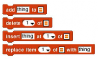
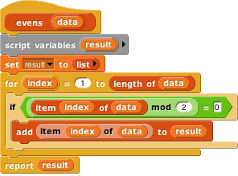
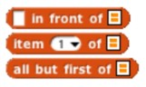
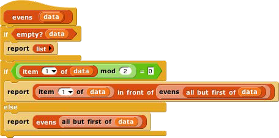

## Functional and Imperative List Programming {#functional-and-imperative-list-programming}

There are two ways to create a list inside a program. Scratch users will be familiar with the _imperative_

programming style, which is based on a set of command blocks that modify a list:

As an example, here is a block that takes a list of numbers as input, and reports a new list containing only the even numbers from the original list:

### In this script, we first create a temporary variable, then put an empty list in it, then go through the items of the input list using the add … to (result) block to modify the result list, adding one item at a time, and finally report the result. {#in-this-script-we-rst-create-a-temporary-variable-then-put-an-empty-list-in-it-then-go-through-the-items-of-the-input-list-using-the-add-to-result-block-to-modify-the-result-list-adding-one-item-at-a-time-and-nally-report-the-result}

Functional programming is a different approach that is becoming important in “real world” programming because of parallelism, i.e., the fact that different processors can be manipulating the same data at the same time. This makes the use of mutation (changing the value associated with a variable) problematic because it’s impossible to know the exact sequence of events, so the result of mutation may not be what the programmer expected. Even without parallelism, though, functional programming is sometimes a simpler and more effective technique, especially when dealing with recursively defined data structures. It uses reporter blocks, not command blocks, to build up a list value:

In a functional program, we often use recursion to construct a list, one item at a time. The in front of block makes a list that has one item added to the front of an existing list, _without changing the value of the original list._ A nonempty list is processed by dividing it into its first item (item 1 of) and all the rest of the items (all but first of), which are handled through a recursive call:

Snap! uses two different internal representations of lists, one (dynamic array) for imperative programming and the other (linked list) for functional programming. Each representation makes the corresponding built-in list blocks (commands or reporters, respectively) most efficient. It’s possible to mix styles in the same program, but if the same list is used both ways, the program will run more slowly because it converts from one representation to the other repeatedly. (The item ( ) of [ ] block doesn’t change the representation.) You don’t have to know the details of the internal representations, but it’s worthwhile to use each list in a consistent way.

