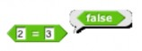
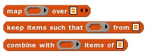
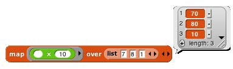
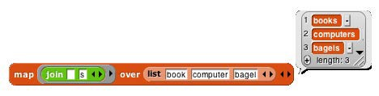
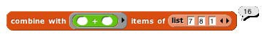

## Higher Order List Operations and Rings {#higher-order-list-operations-and-rings}

There’s an even easier way to select the even numbers from a list:

(If you don’t have the keep block near the bottom of the Variable palette, click the File button in the tool bar and select “Import tools…”)

The keep block takes a Predicate expression as its first input, and a list as its second input. It reports a list containing those elements of the input list for which the predicate returns true. Notice two things about the predicate input: First, it has a grey ring around it. Second, the mod block has an empty input. Keep puts each item of its input list, one at a time, into that empty input before evaluating the predicate. (The empty input is supposed to remind you of the “box” notation for variables in elementary school: ☐+3=7.) The grey ring is part of the keep block as it appears in the palette:

What the ring means is that this input is a block (a predicate block, in this case, because the interior of the ring is a hexagon), rather than the value reported by that block. Here’s the difference:

 

Evaluating the = block without a ring reports true or false; evaluating the block _with_ a ring reports the block itself. This allows keep to evaluate the = predicate repeatedly, once for each list item. A block that takes another block as input is called a _higher order_ block (or higher order procedure, or higher order function).

Snap_!_ provides three higher order blocks for operating on lists:

You’ve already seen keep. Map takes a Reporter block and a list as inputs. It reports a new list in which each item is the value reported by the Reporter block as applied to one item from the input list. That’s a mouthful, but an example will make its meaning clear:

By the way, we’ve been using arithmetic examples, but the list items can be of any type, and any reporter can be used. We’ll make the plurals of some words:

These examples use small lists, to fit the page, but the higher order blocks work for any size list.

The map block has arrowheads at the right end because of a little-used feature that allows mapping through multiple same-length lists in parallel, with a multi-input reporter expression. Don’t worry about it for now; just make sure when you drag an expression into the list input slot that you hit the slot and not the arrowheads.

The third higher order block, combine, computes a single result from _all_ the items of a list, using a _two-input_

reporter as its first input. In practice, there are only a few blocks you’ll ever use with combine:

These blocks take the sum of the list items, take their product, string them into one word, combine them into a sentence (with spaces between items), see if all items of a list of Booleans are true, or see if any of the items is true.

Why + but not −? It only makes sense to combine list items using an _associative_ function: one that doesn’t care in what order the items are combined (left to right or right to left). (2+3)+4 = 2+(3+4), but (2−3)−4 ≠ 2−(3−4).

*   Typed Inputs