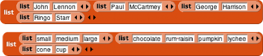
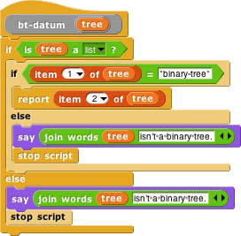

## Lists of Lists {#lists-of-lists}

Lists can be inserted as elements in larger lists. We can easily create ad hoc structures as needed:

We can also build any classic computer science data structure out of lists of lists, by defining _constructors_ (blocks to make an example of the structure), _selectors_ (blocks to pull out a piece of the structure), and _mutators_ (blocks to change the contents of the structure) as needed. Here we create binary trees with selectors that check for input of the correct data type; only one selector is shown but the ones for left and right children are analogous.

