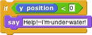
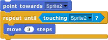
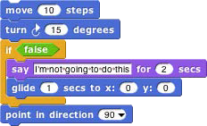

## Predicates and Conditional Evaluation {#predicates-and-conditional-evaluation}

Most reporters report either a number, like , or a text string, like . A _predicate_ is a special kind of reporter that always reports true or false. Predicates have a hexagonal shape:

The special shape is a reminder that predicates don’t generally make sense in an input slot of blocks that are expecting a number or text. You wouldn’t say , although (as you can see from the picture) Snap! lets you do it if you really want. Instead, you normally use predicates in special hexagonal input

slots like this one:

The C-shaped if block runs its input script if (and only if) the expression in its hexagonal input reports true.

A really useful block in animations runs its input script _repeatedly_ until a predicate is satisfied:

If, while working on a project, you want to omit temporarily some commands in a script, but you don’t want to forget where they belong, you can say

Sometimes you want to take the same action whether some condition is true or false, but with a different input value. For this purpose you can use the _reporter_ if block:1

The technical term for a true or false value is a “Boolean” value; it has a capital B because it’s named after a person, George Boole, who developed the mathematical theory of Boolean values. Don’t get confused; a hexagonal block is a _predicate,_ but the value it reports is a _Boolean._

Another quibble about vocabulary: Many programming languages reserve the name “procedure” for Commands (that carry out an action) and use the name “function” for Reporters and Predicates. In this manual, a _procedure_ is any computational capability, including those that report values and those that don’t. Commands, Reporters, and Predicates are all procedures. The words “a Procedure type” are shorthand for “Command type, Reporter type, or Predicate type.”

1 If you don’t see it in the Control palette, click on the File button in the Tool Bar and choose “Import tools.”