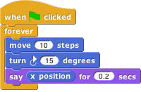
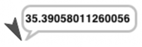
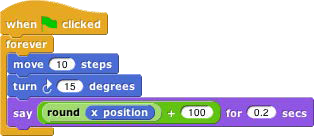
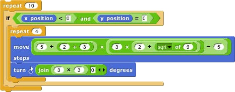

## Reporter Blocks and Expressions {#reporter-blocks-and-expressions}

So far, we’ve used two kinds of blocks: hat blocks and command blocks. Another kind is the _reporter_ block, which has an oval shape: . It’s called a “reporter” because when it’s run, instead of carrying out an action, it reports a value that can be used as an input to another block. If you drag a reporter into the scripting area by itself and click on it, the value it reports will appear in a speech balloon next to the block:

When you drag a reporter block over another block’s input slot, a white “halo” appears around that input slot, analogous to the white line that appears when snapping command blocks together. Here’s a simple script that uses a reporter block:

 

Here the x position reporter provides the first input to the say block. (The sprite’s X position is its horizontal position, how far left (negative values) or right (positive values) it is compared to the center of the stage.

Similarly, the Y position is measured vertically, in steps above (positive) or below (negative) the center.) You can do arithmetic using reporters in the Operators palette:

 

The round block rounds 35.3905… to 35, and the + block adds 100 to that. (By the way, the round block is in the Operators palette, just like +, but in this script it’s a lighter color with black lettering because Snap! alternates light and dark versions of the palette colors when a block is nested inside another block from the same palette:

This aid to readability is called _zebra coloring._) A reporter block with its inputs, maybe including other reporter blocks, such as , is called an _expression._