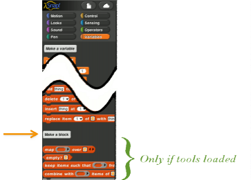
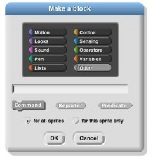
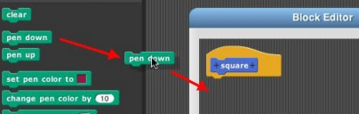
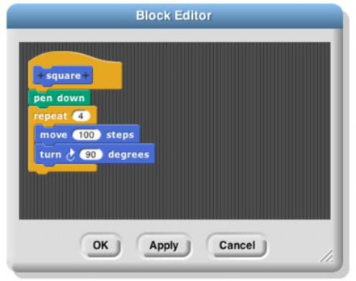
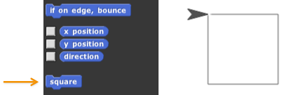
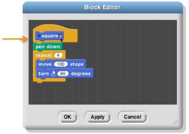
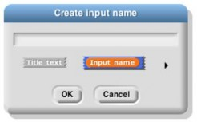
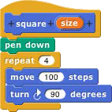
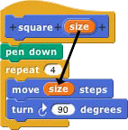

## Simple Blocks {#simple-blocks}

In the Variables palette, at or near the bottom, is a button labeled “Make a block.”

Clicking this button will display a dialog window in which you choose the block’s name, shape, and palette/color. You also decide whether the block will be available to all sprites, or only to the current sprite and its children. Note: You can also enter the “Make a block” dialog by right-click/control-click on the script area background and then choose “Make a block” from the menu that appears.

In this dialog box, you can choose the block's palette, shape and name. With one exception, there is one color per palette, e.g., all Motion blocks are blue. But the Variables palette includes the orange variable-related blocks and the red list-related blocks. Both colors are available, along with an “Other” option that makes grey blocks in the Variables palette for blocks that don’t fit any category.

There are three block shapes, following a convention that should be familiar to Scratch users: The jigsaw- puzzle-piece shaped blocks are Commands, and don’t report a value. The oval blocks are Reporters, and the hexagonal blocks are Predicates, which is the technical term for reporters that report Boolean (true or false) values.

Suppose you want to make a block named “square” that draws a square. You would choose Motion, Command, and type “square” into the name field. When you click OK, you enter the Block Editor. This works just like making a script in the sprite’s scripting area, except that the “hat” block at the top, instead of saying something like “when I am clicked,” has a picture of the block you’re building. This hat block is called the _prototype_ of your custom block.1 You drag blocks under the hat to program your custom block, then click OK:

Your block appears at the bottom of the Motion palette. Here’s the block and the result of using it:

1 This use of the word “prototype” is unrelated to the _prototyping object oriented programming_ discussed later.

Custom Blocks with Inputs

But suppose you want to be able to draw squares of different sizes. Control-click or right-click on the block, choose “edit,” and the Block Editor will open. Notice the plus signs before and after the word square in the prototype block. If you hover the mouse over one, it lights up:

Click on the plus on the right. You will then see the “input name” dialog:

Type in the name “size” and click OK. There are other options in this dialog; you can choose “title text” if you want to add words to the block name, so it can have text after an input slot, like the “move ( ) steps” block. Or you can select a more extensive dialog with a lot of options about your input name. But we’ll leave that for later. When you click OK, the new input appears in the block prototype:

You can now drag the orange variable down into the script, then click okay:

Your block now appears in the Motion palette with an input box:

You can draw any size square by entering the length of its side in the box and running the block as usual, by double-clicking it or by putting it in a script.