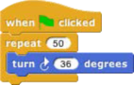
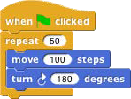
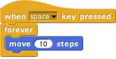
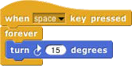
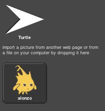
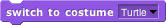
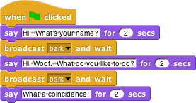
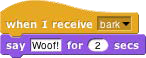

## Sprites and Parallelism {#sprites-and-parallelism}

Just below the stage is the “new sprite” button . Click the button to add a new sprite to the stage. The new sprite will appear in a random position on the stage, facing in a random direction, with a random color.

Each sprite has its own scripts. To see the scripts for a particular sprite in the scripting area, click on the picture of that sprite in the _sprite corral_ in the bottom right corner of the window. Try putting one of the following scripts in each sprite’s scripting area:

 

When you click the green flag, you should see one sprite rotate while the other moves back and forth. This experiment illustrates the way different scripts can run in parallel. The turning and the moving happen together. Parallelism can be seen with multiple scripts of a single sprite also. Try this example:

 

When you press the space key, the sprite should move forever in a circle, because the move and turn blocks are run in parallel. (To stop the program, click the red stop sign at the right end of the tool bar.)

Costumes and Sounds

To change the appearance of a sprite, import a new _costume_ for it. There are three ways to do this. First, select the desired sprite in the sprite corral. Then, one way is to click on the file icon in the tool bar, then choose the “Costumes…”menu item. You will see a list of costumes from the public media library, and can choose one. The second way, for a costume stored on your own computer, is too click on the file icon and choose the

“Import…” menu item. You can then select a file in any picture format (PNG, JPEG, etc.) supported by your browser. The third way is quicker if the file you want is visible on the desktop: Just drag the file onto the Snap! window. In any of these cases, the scripting area will be replaced by something like this:

Just above this part of the window is a set of three tabs: Scripts, Costumes, and Sounds. You’ll see that the Costumes tab is now selected. In this view, the sprite’s _wardrobe,_ you can choose whether the sprite should wear its Turtle costume or its Alonzo costume. (Alonzo, the Snap! mascot, is named after Alonzo Church, a mathematician who invented the idea of procedures as data, the most important way in which Snap! is different from Scratch.) You can give a sprite as many costumes as you like, and then choose which it will wear either by

clicking in its wardrobe or by using the or block in a script. (Every costume has a number as well as a name. The next costume block selects the next costume by number; after

the highest-numbered costume it switches to costume 1\. The Turtle, costume 0, is never chosen by next costume.) The Turtle costume is the only one that changes color to match a change in the sprite’s pen color.

In addition to its costumes, a sprite can have _sounds;_ the equivalent for sounds of the sprite’s wardrobe is called its _jukebox._ Sound files can be imported in any format (WAV, OGG, MP3, etc.) supported by your browser.

Two blocks accomplish the task of playing sounds. If you would like a script to continue running while the sound is playing, use the block . In contrast, you can use the block to wait for the sound's completion before continuing the rest of the script_._

Inter-Sprite Communication with Broadcast

Earlier we saw an example of two sprites moving at the same time. In a more interesting program, though, the sprites on stage will _interact_ to tell a story, play a game, etc. Often one sprite will have to tell another sprite to run a script. Here’s a simple example:

   

In the block, the word “bark” is just an arbitrary name I made up. When you click on the downward arrowhead in that input slot, one of the choices (the only choice, the first time) is “new,” which

then prompts you to enter a name for the new broadcast. When this block is run, the chosen message is sent to _every_ sprite, which is why the block is called “broadcast.” In this program, though, only one sprite has a script to run when that broadcast is sent, namely the dog. Because the boy’s script uses broadcast and wait rather than just broadcast, the boy doesn’t go on to his next say block until the dog’s script finishes. That’s why the two sprites take turns talking, instead of both talking at once.

Notice, by the way, that the say block’s first input slot is rectangular rather than oval. This means the input can be any text string, not only a number. In the text input slots, a space character is shown as a brown dot, so that you can count the number of spaces between words, and in particular you can tell the difference between an empty slot and one containing spaces. The brown dots are _not_ shown on the stage when the block is run.

The stage has its own scripting area. It can be selected by clicking on the Stage icon at the left of the sprite corral. Unlike a sprite, though, the stage can’t move. Instead of costumes, it has _backgrounds:_ pictures that fill the entire stage area. The sprites appear in front of the current background. In a complicated project, it’s often convenient to use a script in the stage’s scripting area as the overall director of the action.