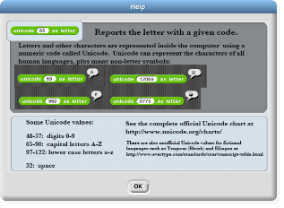
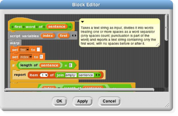
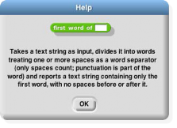
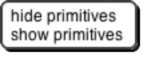

## The Palette Area {#the-palette-area}

At the top of the palette area are the eight buttons that select which palette (which block category) is shown: Motion, Looks, Sound, Pen, Control, Sensing, Operators, and Variables (which also includes the List and Other blocks). There are no menus behind these buttons.

Context Menus for Palette Blocks

If you control-click/right-click a _primitive_ block in the palette, you see this menu:

The help… option displays a box with documentation about the block. Here’s an example:

The hide option removes that block from the palette. (This option is available only when clicking the block in the palette itself, not in a script.) The purpose of the option is to allow teachers to present students with a simplified Snap! with some features effectively removed. The hiddenness of primitives is saved with each project, so students can load a shared project and see just the desired blocks.

If you control-click/right-click a _custom_ (user-defined) block in the palette, you see this menu:

The help… option for a custom block displays the comment, if any, attached to the custom block’s hat block in the Block Editor. Here is an example of a block with a comment and its help display:

 

The same comment is also shown while hovering over the custom block in the palette.

The delete block definition… option asks for confirmation, then deletes the custom block and removes it from any scripts in which it appears. (The result of this removal may not leave a sensible script; it’s best to find and correct such scripts _before_ deleting a block.) Note that there is no option to _hide_ a custom block.

The edit… option opens a Block Editor with the definition of the custom block.

Context Menu for the Palette Background

Right-click/control-click on the grey _background_ of the palette area shows this menu:

The hide primitives option hides _all_ of the primitives in that palette. The show primitives option, which is in the menu only if some primitives of this palette are hidden, unhides all of them.