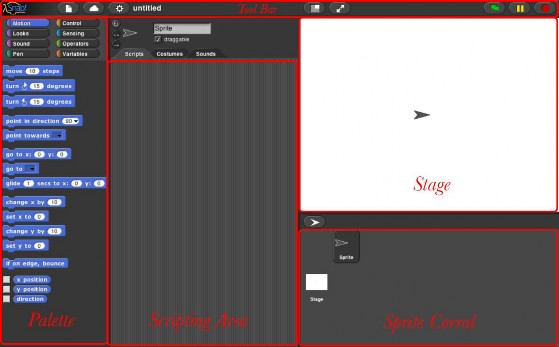
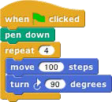
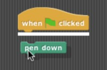

# 4.0 {#4-0}

SNAP! Reference Manual

Brian Harvey Jens Mönig

Table of Contents

1.  Blocks, Scripts, and Sprites 4

    Hat Blocks and Command Blocks 5

    1.  Sprites and Parallelism 6

        Costumes and Sounds 6

        Inter-Sprite Communication with Broadcast 7

    2.  Nesting Sprites: Anchors and Parts 8

    3.  Reporter Blocks and Expressions 8

    4.  Predicates and Conditional Evaluation 10

    5.  Variables 11 Global Variables 12 Script Variables 13

    6.  Etcetera 13

2.  Saving and Loading Projects and Media 14

    1.  Local Storage 14 Localstore 14 XML Export 15

    2.  Cloud Storage 15

    3.  Loading Saved Projects 16

3.  Building a Block 17

    1.  Simple Blocks 17

        Custom Blocks with Inputs 19

    2.  Recursion 20

    3.  Block Libraries 21

4.  First Class Lists 22

    1.  The list Block 22

    2.  Lists of Lists 23

    3.  Functional and Imperative List Programming 24

    4.  Higher Order List Operations and Rings 25

5.  Typed Inputs 27

    1.  Scratch’s Type Notation 27

    2.  The Snap! Input Type Dialog 27

        Procedure Types 28

        Pulldown inputs 29

        Input variants 30

        Prototype Hints 31

        Title Text and Symbols 31

6.  Procedures as Data 32

    1.  Call and Run 32 Call/Run with inputs 32 Variables in Ring Slots 33

    2.  Writing Higher Order Procedures 33

        Recursive Calls to Multiple-Input Blocks 35

    3.  Formal Parameters 36

    4.  Procedures as Data 37

    5.  Special Forms 38

        Special Forms in Scratch 39

7.  Object Oriented Programming 40

    1.  Local State with Script Variables 41

    2.  Messages and Dispatch Procedures 42

    3.  Inheritance via Delegation 43

    4.  An Implementation of Prototyping OOP 43

8.  The Outside World 47

    1.  The World Wide Web 47

    2.  Hardware Devices 48

    3.  Date and Time 48

9.  Continuations 49

    1.  Continuation Passing Style 50

    2.  Call/Run w/Continuation 53

        Nonlocal exit 55

10.  User Interface Elements 57

    1.  _Tool Bar Features 57_ The Snap! Logo Menu 57 The File Menu 58

        The Cloud Menu 61 The Settings Menu 62

        Stage Resizing Buttons 64 Project Control Buttons 64

    2.  The Palette Area 65

        Context Menus for Palette Blocks 65 Context Menu for the Palette Background 66

    3.  The Scripting Area 66

        Sprite Appearance and Behavior Controls 66 Scripting Area Tabs 67

        Scripts and Blocks Within Scripts 67 Scripting Area Background Context Menu 68 Controls in the Costumes Tab 70

        The Paint Editor 71

        Controls in the Sounds Tab 72

    4.  Controls on the Stage 72

    5.  The Sprite Corral and Sprite Creation Buttons 73

Index 75

Acknowledgements

We have been extremely lucky in our mentors. Jens cut his teeth in the company of the Smalltalk pioneers: Alan Kay, Dan Ingalls, and the rest of the gang who invented personal computing and object oriented programming in the great days of Xerox PARC. He worked with John Maloney, of the MIT Scratch Team, who developed the Morphic graphics framework that’s still at the heart of Snap!.

#### The brilliant design of Scratch, from the Lifelong Kindergarten Group at the MIT Media Lab, is crucial to Snap!. Our earlier version, BYOB, was a direct modification of the Scratch source code. Snap! is a complete rewrite, but its code structure and its user interface remain deeply indebted to Scratch. And the Scratch Team, who could have seen us as rivals, have been entirely supportive and welcoming to us. {#the-brilliant-design-of-scratch-from-the-lifelong-kindergarten-group-at-the-mit-media-lab-is-crucial-to-snap-our-earlier-version-byob-was-a-direct-modification-of-the-scratch-source-code-snap-is-a-complete-rewrite-but-its-code-structure-and-its-user-interface-remain-deeply-indebted-to-scratch-and-the-scratch-team-who-could-have-seen-us-as-rivals-have-been-entirely-supportive-and-welcoming-to-us}

Brian grew up at the MIT and Stanford Artificial Intelligence Labs, learning from Lisp inventor John McCarthy, Scheme inventors Gerald J. Sussman and Guy Steele, and the authors of the world’s best computer science book, _Structure and Interpretation of Computer Programs,_ Hal Abelson and Gerald J. Sussman with Julie Sussman, among many other heroes of computer science.

#### In the glory days of the MIT Logo Lab, we used to say, “Logo is Lisp disguised as BASIC.” Now, with its first class procedures, lexical scope, and first class continuations, Snap! is Scheme disguised as Scratch. {#in-the-glory-days-of-the-mit-logo-lab-we-used-to-say-logo-is-lisp-disguised-as-basic-now-with-its-first-class-procedures-lexical-scope-and-first-class-continuations-snap-is-scheme-disguised-as-scratch}

We have been fortunate to get to know an amazing group of brilliant middle school(!) and high school students through the Scratch Advanced Topics forum, several of whom have contributed code to Snap!: Kartik Chandra, Nathan Dinsmore, Connor Hudson, and Ian Reynolds. Many more have contributed ideas and alpha-testing bug reports. UC Berkeley students who’ve contributed code include Michael Ball, Achal Dave. Kyle Hotchkiss, Ivan Motyashov, and Yuan Yuan. Contributors of translations are too numerous to list here, but they’re in the “About…” box in Snap! itself.

This work was supported in part by the National Science Foundation grant 1143566, and in part by MioSoft.

Snap_!_ Reference Manual

Version 4.0

Snap! (formerly BYOB) is an extended reimplementation of Scratch (http://scratch.mit.edu) that allows you to Build Your Own Blocks. It also features first class lists, first class procedures, and continuations. These added capabilities make it suitable for a serious introduction to computer science for high school or college students.

To run Snap!, open a browser window and connect to either [http://snap.berkeley.edu/run](http://snap.berkeley.edu/run) [to start with a minimal set of blocks or](http://snap.berkeley.edu/init) [http://snap.berkeley.edu/init](http://snap.berkeley.edu/init) to load a small set of additional blocks (a little slower startup, but recommended for convenience and assumed in this manual).

1.  Blocks, Scripts, and Sprites

    This secction describes the Snap! features inherited from Scratch; experienced Scratch users can skip to subsection B.

    Snap! is a programming language — a notation in which you can tell a computer what you want it to do. Unlike most programming languages, though, Snap! is a _visual_ language; instead of writing a program using the keyboard, the Snap! programmer uses the same drag-and-drop interface familiar to computer users.

    Start Snap!. You should see the following arrangement of regions in the window:

    

    (The proportions of these areas may be different, depending on the size and shape of your browser window.) A Snap! program consists of one or more _scripts,_ each of which is made of _blocks._ Here’s a typical script:

    

    The five blocks that make up this script have three different colors, corresponding to three of the eight _palettes_ in which blocks can be found. The palette area at the left edge of the window shows one palette at a time, chosen with the eight buttons just above the palette area. In this script, the gold blocks are from the Control palette; the green block is from the Pen palette; and the blue blocks are from the Motion palette. A script is assembled by dragging blocks from a palette into the _scripting area_ in the middle part of the window. Blocks snap together (hence the name Snap! for the language) when you drag a block so that its indentation is near the tab of the one above it:

    

    The white horizontal line is a signal that if you let go of the green block it will snap into the tab of the gold one.

    Hat Blocks and Command Blocks

    At the top of the script is a _hat_ block, which indicates when the script should be carried out. Hat block names typically start with the word “when”; in this example, the script should be run when the green flag near the right end of the Snap! tool bar is clicked. (The Snap! tool bar is part of the Snap! window, not the same as the browser’s or operating system’s menu bar.) A script isn’t required to have a hat block, but if not, then the script will be run only if the user clicks on the script itself. A script can’t have more than one hat block, and the hat block can be used only at the top of the script; its distinctive shape is meant to remind you of that.

    The other blocks in this script are _command_ blocks. Each command block corresponds to an action that Snap! already knows how to carry out. For example, the block tells the sprite (the arrowhead shape on the _stage_ at the right end of the window) to move ten steps (a step is a very small unit of distance) in the direction in which the arrowhead is pointing. We’ll see shortly that there can be more than one sprite, and that each sprite has its own scripts. Also, a sprite doesn’t have to look like an arrowhead, but can have any picture as

    a _costume._ The shape of the move block is meant to remind you of a Lego™ brick; a script is a stack of blocks. (The word “block” denotes both the graphical shape on the screen and the procedure, the action, that the block carries out.)

    The number 10 in the move block above is called an _input_ to the block. By clicking on the white oval, you can type any number in place of the 10\. The sample script on the previous page uses 100 as the input value. We’ll see later that inputs can have non-oval shapes that accept values other than numbers. We’ll also see that you can compute input values, instead of typing a particular value into the oval. A block can have more than one input slot. For example, the glide block located about halfway down the Motion palette has three inputs.

    Most command blocks have that brick shape, but some, like the repeat block in the sample script, are _C-shaped._ Most C-shaped blocks are found in the Control palette. The slot inside the C shape is a special kind of input slot that accepts a _script_ as the input. In the sample script, the repeat block has two inputs: the number 4 and the script

    