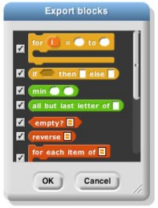

## Block Libraries {#block-libraries}

When you save a project (see Section II above), any custom blocks you’ve made are saved with it. But sometimes you’d like to save a collection of blocks that you expect to be useful in more than one project. The tools library we’ve used throughout this manual is an example. Perhaps your blocks implement a particular data structure (a stack, or a dictionary, etc.), or they’re the framework for building a multilevel game. Such a collection of blocks is called a _block library._

Creating a block library is done using the XML Export mechanism described on page 15, except that you choose “Export blocks…” from the File menu instead of “Export project…” You then see a window like this:

The window shows all of your global custom blocks. You can uncheck some of the checkboxes to select exactly which blocks you want to include in your library. (You can right-click or control-click on the export window for a menu that lets you check or uncheck all the boxes at once.) Then press OK. You’ll see a new tab with XML- encoded block definitions, which you save using your browser’s Save command.

To import a block library, use the “Import…” command in the File menu, or just drag the XML file into the

Snap_!_ window.

*   First Class Lists

    A data type is _first class_ in a programming language if data of that type can be

    *   the value of a variable

    *   an input to a procedure

    *   the value returned by a procedure

    *   a member of a data aggregate

    *   anonymous (not named)

        In Scratch, numbers and text strings are first class. You can put a number in a variable, use one as the input to a block, call a reporter that reports a number, or put a number into a list.

        But Scratch’s lists are not first class. You create one using the “Make a list” button, which requires that you give the list a name. You can’t put the list into a variable, into an input slot of a block, or into a list item—you can’t have lists of lists. None of the Scratch reporters reports a list value. (You can use a reduction of the list into a text string as input to other blocks, but this loses the list structure; the input is just a text string, not a data aggregate.)

        A fundamental design principle in Snap! is that <u>_**all data should be first class**_</u>_._ If it’s in the language, then we should be able to use it fully and freely. We believe that this principle avoids the need for many special-case tools, which can instead be written by Snap! users themselves.

        Note that it’s a data _type_ that’s first class, not an individual value. Don’t think, for example, that some lists are first class, while others aren’t. In Snap!, lists are first class, period.

        