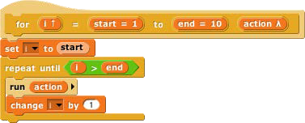
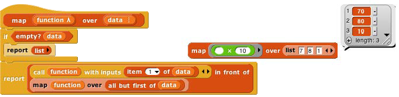
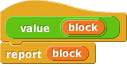
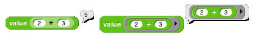

## Call and Run {#call-and-run}

In the for block example above, the input named action has been declared as type “Command (C-shaped)”; that’s why the finished block is C-shaped. But how does the block actually tell Snap! to carry out the commands inside the C-slot? Here is a simple version of the block script:

This is simplified because it assumes, without checking, that the ending value is greater than the starting value; if not, the block should (depending on the designer’s purposes) either not run at all, or change the variable by −1 instead of by 1\. (The for block in Snap!’s tool library works for ascending or descending values; you can read its script by right-clicking or control-clicking on it and selecting the Edit option.)

The important part of this script is the run block near the end. This is a Snap! built-in command block that takes a Command-type value (a script) as its input, and carries out its instructions. (In this example, the value of the input is the script that the user puts in the C-slot of the for block.) There is a similar call reporter block for invoking a Reporter or Predicate block. The call and run blocks are at the heart of Snap!’s first class procedure feature; they allow scripts and blocks to be used as data — in this example, as an input to a block — and eventually carried out under control of the user’s program.

Here’s another example, this time using a Reporter-type input in a simplified map block (see page 22):

Here we are calling the Reporter “multiply by 10” three times, once with each item of the given list as its input, and collecting the results as a list. (The reported list will always be the same length as the input list.) Note that the multiplication block has two inputs, but here we have specified a particular value for one of them (10), so the call block knows to use the input value given to it just to fill the other (empty) input slot in the multiplication block. In the map definition, the input function is declared to be type Reporter, and data is of type List.

### Call/Run with inputs {#call-run-with-inputs}

The call block (like the run block) has a right arrowhead at the end; clicking on it adds the phrase “with inputs” and then a slot into which an input can be inserted:

If the left arrowhead is used to remove the last input slot, the “with inputs” disappears also. The right arrowhead can be clicked as many times as needed for the number of inputs required by the reporter block being called.

If the number of inputs given to call (not counting the Reporter-type input that comes first) is the same as the number of empty input slots, then the empty slots are filled from left to right with the given input values. If call is given exactly one input, then _every_ empty input slot of the called block is filled with the same value:

If the number of inputs provided is neither one nor the number of empty slots, then there is no automatic filling of empty slots. (Instead you must use explicit parameters in the ring, as discussed in subsection C below.)

An even more important thing to notice about these examples is the _ring_ around the Reporter-type input slots in call and map above. This notation indicates that _the block itself,_ not the number or other value that the block would report when called, is the input. If you want to use a block itself in a non-Reporter-type (e.g., Any-type) input slot, you can enclose it explicitly in a ring, found at the top of the Operators palette.

As a shortcut, if you right-click or control-click on a block (such as the + block in this example), one of the choices in the menu that appears is “ringify” or “unringify.” The ring indicating a Reporter-type or Predicate-

  

type input slot is essentially the same idea for reporters as the C-shaped input slot with which you’re already familiar; with a C-shaped slot, it’s _the script_ you put in the slot that becomes the input to the C-shaped block.

Variables in Ring Slots

Note that the run block in the definition of the for block (page 32) doesn’t have a ring around its input variable action. When you drag a variable into a ringed input slot, you generally _do_ want to use _the value of_ the variable, which will be the block or script you’re trying to run or call, rather than the orange variable reporter itself. So Snap! automatically removes the ring in this case. If you ever do want to use the variable _block itself,_ rather than the value of the variable, as a Procedure-type input, you can drag the variable into the input slot, then control- click or right-click it and choose “ringify” from the menu that appears. (Similarly, if you ever want to call a function that will report a block to use as the input, you can choose “unringify” from the menu. Almost all the time, though, Snap! does what you mean without help.)