## Call/Run w/Continuation {#call-run-w-continuation}

To use explicit continuation passing style, we had to define special versions of all the reporters, add and so on. Snap! provides a primitive mechanism for capturing continuations when we need to, without using continuation passing throughout a project.

Here’s the classic example. We want to write a recursive block that takes a list of numbers as input, and reports the product of all the numbers:

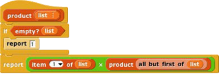

But we can improve the efficiency of this block, in the case of a list that includes a zero; as soon as we see the zero, we know that the entire product is zero.

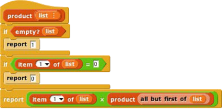

But this is not as efficient as it might seem. Consider, as an example, the list 1,2,3,0,4,5\. We find the zero on the third recursive call (the fourth call altogether), as the first item of the sublist 0,4,5\. What is the continuation of the report 0 block? It’s

Even though we already know that result is zero, we’re going to do three unnecessary multiplications while unwinding the recursive calls.

We can improve upon this by capturing the continuation of the top-level call to product:

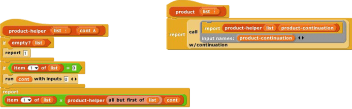

The block takes as its input a one-input script, as shown in the product example. It calls that script with _the continuation of the_ call-with-continuation _block itself_ as its input. In this case, that continuation is

reporting to whichever script called product. If the input list doesn’t include a zero, then nothing is ever done with that continuation, and this version works just like the original product. But if the input list is 1,2,3,0,4,5, then three recursive calls are made, the zero is seen, and product-helper _runs the continuation,_ with an input of 0\. The continuation immediately reports that 0 to the caller of product, _without_ unwinding all the recursive calls and without the unnecessary multiplications.

I could have written product a little more simply using a Reporter ring instead of a Command ring:

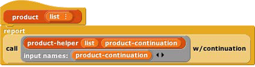

but it’s customary to use a script to represent the input to call w/continuation because very often that input takes the form

so that the continuation is saved permanently and can be called from anywhere in the project. That’s why the input slot in call w/continuation has a Command ring rather than a Reporter ring.

First class continuations are an experimental feature in Snap! and there are many known limitations in it.

Nonlocal exit

Many programming languages have a break command that can be used inside a looping construct such as repeat to end the repetition early. Using first class continuations, we can generalize this mechanism to allow nonlocal exit even within a block called from inside a loop, or through several levels of nested loops:

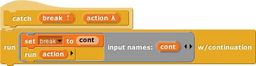 

The upvar break has as its value a continuation that can be called from anywhere in the program to jump immediately to whatever comes after the catch block in its script. Here’s an example with two nested invocations of catch, with the upvar renamed in the outer one:

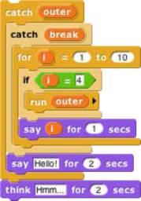

As shown, this will say 1, then 2, then 3, then exit both nested catches and think “Hmm.” If in the run block the variable break is used instead of outer, then the script will say 1, 2, 3, and “Hello!” before thinking “Hmm.”

There are corresponding catch and throw blocks for reporters. The catch block is a reporter that takes an expression as input instead of a C-shaped slot. But the throw block is a command; it doesn’t report a value to its own continuation, but instead reports a value (which it takes as an additional input, in addition to the catch tag) to _the corresponding_ catch _block_’s continuation:

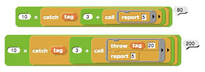

Without the throw, the inner call reports 5, the + block reports 8, so the catch block reports 8, and the × block reports 80\. With the throw, the inner call doesn’t report at all, and neither does the + block. The throw block’s input of 20 becomes the value reported by the catch block, and the × block multiplies 10 and 20.

Creating a Thread System

Snap! can be running several scripts at once, within a single sprite and across many sprites. If you only have one computer, how can it do many things at once? The answer is that only one is actually running at any moment, but Snap! switches its attention from one script to another frequently. At the bottom of every looping block (repeat, repeat until, forever), there is an implicit “yield” command, which remembers where the current script is up to, and switches to some other script, each in turn. At the end of every script is an implicit “end thread” command (a _thread_ is the technical term for the process of running a script), which switches to another script without remembering the old one.

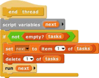

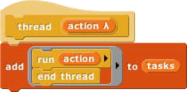

Since this all happens automatically, there is generally no need for the user to think about threads. But, just to show that this, too, is not magic, here is an implementation of a simple thread system. It uses a global variable named tasks that initially contains an empty list. Each use of the C-shaped thread block adds a continuation (the ringed script) to the list. The yield block uses run w/continuation to create a continuation for a partly done thread, adds it to the task list, and then runs the first waiting task. The end thread block (which is automatically added at the end of every thread’s script by the thread block) just runs the next waiting task.

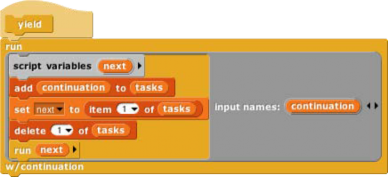

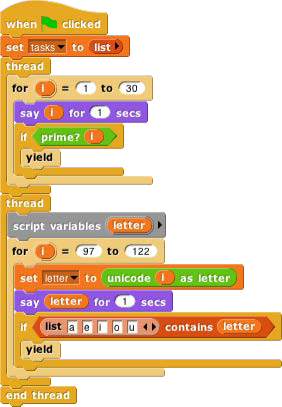

Here is a sample script using the thread system. One thread says numbers; the other says letters. The number thread yields after every prime number, while the letter thread yields after every vowel. So the sequence of speech balloons is 1,2,a,3,b,c,d,e,4,5,f,g,h,i,6,7,j,k,l,m,n,o,8,9,10,11,

p,q,r,s,t,u,12,13,v,w,x,y,z,14,15,16,17,18,…30.

If we wanted this to behave exactly like Snap!’s own threads, we’d define new versions of repeat and so on that run yield after each repetition.

*   User Interface Elements

In this section we describe in detail the various buttons, menus, and other clickable elements of the Snap! user interface. Here again is the map of the Snap! window:

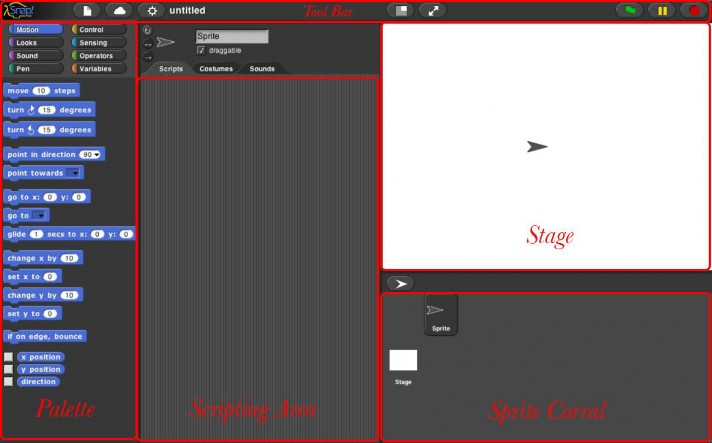