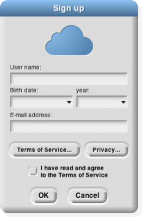
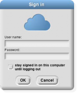

## Cloud Storage {#cloud-storage}

The other possibility is to save your project “in the cloud,” at the Snap! web site. In order to do this, you need an account with us. Click on the Cloud button ( ) in the Tool Bar. Choose the “Signup…” option. This will show you a window that looks like this:

You must choose a user name that will identify you on the web site, such as Jens or bh. If you’re a Scratch user, you can use your Scratch name for Snap! too. If you’re a kid, don’t pick a user name that includes your family name, but first names or initials are okay. Don’t pick something you’d be embarrassed to have other users (or your parents) see! If the name you want is already taken, you’ll have to choose another one.

We ask for your month and year of birth; we use this information only to decide whether to ask for your own email address or your parent’s email address. (If you’re a kid, you shouldn’t sign up for anything on the net, not even Snap!, without your parent’s knowledge.) We do not store your birthdate information on our server; it is used on your own computer only during this initial signup. We do not ask for your _exact_ birthdate, even for this one-time purpose, because that’s an important piece of personally identifiable information.

When you click OK, an email will be sent to the email address you gave, with an initial password for your account. We keep your email address on file so that, if you forget your password, we can send you a password- reset link. We will also email you if your account is suspended for violation of the Terms of Service. We do not

15

use your address for any other purpose. You will never receive marketing emails of any kind through this site, neither from us nor from third parties. If, nevertheless, you are worried about providing this information, do a web search for “temporary email.”

Finally, you must read and agree to the Terms of Service. A quick summary: Don’t interfere with anyone else’s use of the web site, and don’t put copyrighted media or personally identifiable information in projects that you share with other users. And we’re not responsible if something goes wrong. (Not that we _expect_ anything to go wrong; since Snap! runs in Javascript in your browser, it is strongly isolated from the rest of your computer.

But the lawyers make us say this.)

Once you’ve created your account, you can log into it using the “Login…” option from the Cloud menu:

Use the user name and password that you set up earlier. If you check the “Stay signed in” box, then you will be logged in automatically the next time you run Snap! from the same browser on the same computer. Check the box if you’re using your own computer and you don’t share it with siblings. Don’t check the box if you’re using a public computer at the library, at school, etc.

Once logged in, you can choose the “Cloud” option in the “Save as…” dialog shown on page 14\. You enter a project name, and optionally project notes, just as for Localstore saving, but your project will be saved online and can be loaded from anywhere with net access.