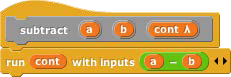
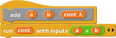
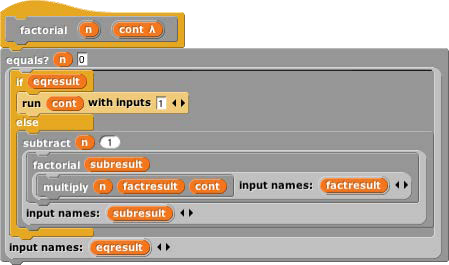
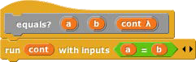
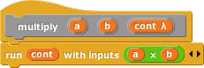
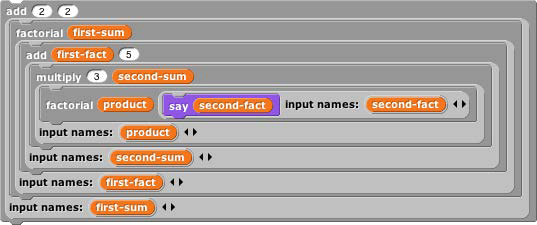

## Continuation Passing Style {#continuation-passing-style}

Like all programming languages, Snap! evaluates compositions of nested reporters from the inside out. For example, in the expression Snap! first adds 4 and 5, then multiplies 3 by that sum. This often means that the order in which the operations are done is backwards from the order in which they appear in the expression: When reading the above expression you say “times” before you say “plus.” In English, instead of saying “three times four plus five,” which actually makes the order of operations ambiguous, you could say, “take the sum of four and five, and then take the product of three and that sum.” This sounds more awkward, but it has the virtue of putting the operations in the order in which they’re actually performed.

That may seem like overkill in a simple expression, but suppose you’re trying to convey the expression

to a friend over the phone. If you say “factorial of three times factorial of two plus two plus five” you might mean any of these:

Wouldn’t it be better to say, “Add two and two, take the factorial of that, add five to that, multiply three by that, and take the factorial of the result”? We can do a similar reordering of an expression if we first define versions of all the reporters that take their continuation as an explicit input. In the following picture, notice that the new blocks are _commands_, not reporters.

We can check that these blocks give the results we want:

The original expression can now be represented as

If you read this top to bottom, don’t you get “Add two and two, take the factorial of that, add five to that, multiply three by that, and take the factorial of the result”? Just what we wanted! This way of working, in which every block is a command that takes a continuation as one of its inputs, is called _continuation-passing style (CPS)._ Okay, it looks horrible, but it has subtle virtues. One of them is that each script is just one block long (with the rest of the work buried in the continuation given to that one block), so each block doesn’t have to remember what else to do — in the vocabulary of this section, the (implicit) continuation of each block is empty. Instead of the usual picture of recursion, with a bunch of little people all waiting for each other, with CPS what happens is that each little person hands off the problem to the next one and goes to the beach, so there’s only one active little person at a time. In this example, we start with Alfred, an add specialist, who computes the value 4 and then hands off the rest of the problem to Francine, a factorial specialist. She computes the value 24, then hands the problem off to Anne, another add specialist, who computes 29\. And so on, until finally Sam, a say specialist, says the value 2.107757298379527×10132, which is a very large number!

Go back to the definitions of these blocks. The ones, such as add, that correspond to primitive reporters are simple; they just call the reporter and then call their continuation with its result. But the definition of factorial is more interesting. It doesn’t just call our original factorial reporter and send the result to its continuation.

CPS is used inside factorial too! It says, “See if my input is zero. Send the (true or false) result to if. If the result is true, then call my continuation with the value 1\. Otherwise, subtract 1 from my input. Send the result of that to (a recursive call to) factorial, with a continuation that multiplies the smaller number’s factorial by my original input. Finally, call my continuation with the product.” You can use CPS to unwind even the most complicated branched recursions.

By the way, I cheated a bit above. The if/else block should also use CPS; it should take one true/false input and _two continuations._ It will go to one or the other continuation depending on the value of its input. But in fact the C-shaped blocks (or E-shaped, like if/else) are really using CPS in the first place, because they implicitly wrap rings around the sub-scripts within their branches. See if you can make an explicitly CPS if/else block.