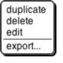

## Controls on the Stage {#controls-on-the-stage}

The stage is the area in the top right of the Snap! window in which sprites move.

Most sprites can be moved by clicking and dragging them. (If you have unchecked the draggable checkbox for a sprite, then dragging it has no effect.) Control-clicking/right-clicking a sprite shows this context menu:

The duplicate option makes another sprite with the same scripts, same costumes, etc., as this sprite. The new sprite starts at a randomly chosen position different from the original, so you can see quickly which is which.

The new sprite is _selected:_ It becomes the current sprite, the one shown in the scripting area.

The delete option deletes the sprite. It’s not just hidden; it’s gone for good. The edit option selects the sprite. It doesn’t actually change anything about the sprite, despite the name; it’s just that making changes in the scripting area will change this sprite.

The export option opens a new browser tab containing the XML text representation of the sprite. (Not just its costume, but all of its costumes, scripts, local variables and blocks, and other properties.) You can save this tab into a file on your computer, and later import the sprite into another project.

Control-clicking/right-clicking on the stage background (that is, anywhere on the stage except on a sprite) shows the stage’s own context menu:

The stage’s edit option selects the stage, so the stage’s scripts and backgrounds are seen in the scripting area. Note that when the stage is selected, some blocks, especially the Motion ones, are not in the palette area because the stage can’t move.

The show all option makes all sprites visible, both in the sense of the show block and by bringing the sprite onstage if it has moved past the edge of the stage.

The pic… option opens a browser tab with a picture of everything on the stage: its background, lines drawn with the pen, and any visible sprites. What you see is what you get. (If you want a picture of just the background, select the stage, open its costumes tab, control-click/right-click on a background, and export it.)