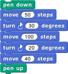
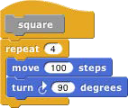

## Date and Time {#date-and-time}

The current block in the Sensing palette can be used to find out the current date or time. Each call to this block reports one component of the date or time, so you will probably combine several calls, like this:

for Americans, or like this:

for Europeans.

*   Continuations

    Blocks are usually used within a script. The _continuation_ of a block within a particular script is the part of the computation that remains to be completed after the block does its job. A continuation can be represented as a ringed script. Continuations are always part of the interpretation of any program in any language, but usually these continuations are implicit in the data structures of the language interpreter or compiler. Making continuations explicit is an advanced but versatile programming technique that allows users to create control structures such as nonlocal exit and multithreading.

    In the simplest case, the continuation of a command block may just be the part of the script after the block.

    For example, in the script

    

    the continuation of the move 100 steps block is

    

    But some situations are more complicated. For example, what is the continuation of move 100 steps in the following script?

    

    That’s a trick question; the move block is run four times, and it has a different continuation each time. The first time, its continuation is

    

    Note that there is no repeat 3 block in the actual script, but the continuation has to represent the fact that there are three more times through the loop to go. The fourth time, the continuation is just

    

    What counts is not what’s physically below the block in the script, but what computational work remains to be done.

    When a block is used inside a custom block, its continuation may include parts of more than one script. For example, if we make a custom square block

    

    and then use that block in a script:

    

    then the continuation of the first use of move 100 steps is

    

    in which part comes from inside the square block and part comes from the call to square. Nevertheless, ordinarily when we _display_ a continuation we show only the part within the current script.

    The continuation of a command block, as we’ve seen, is a simple script with no input slots. But the continuation of a reporter block has to do something with the value reported by the block, so it takes that value as input. For example, in the script

    

    the continuation of the 3+4 block is

    

    Of course the name result in that picture is arbitrary; any name could be used, or no name at all by using the empty-slot notation for input substitution.