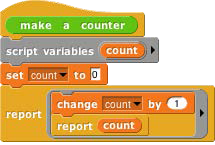
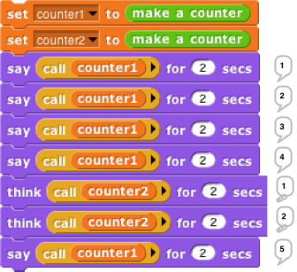

## Local State with Script Variables {#local-state-with-script-variables}

This script implements an object _class_, a type of object, namely the counter class. In this first simplified version there is only one method, so no explicit message passing is necessary. When the make a counter block is called, it reports a procedure, the ringed script inside its body. That procedure implements a specific counter object, an _instance_ of the counter class. When invoked, a counter instance increases and reports its count variable. Each counter has its own local count:

This example will repay careful study, because it isn’t obvious why each instance has a separate count. From the point of view of the make a counter procedure, each invocation causes a new count variable to be created. Usually such _script variables_ are temporary, going out of existence when the script ends. But this one is special, because make a counter returns another script that makes reference to the count variable, so it remains active. (The script variables block makes variables local to a script. It can be used in a sprite’s script area or in the Block Editor. Script variables can be “exported” by being used in a reported procedure, as here.)

In this approach to OOP, we are representing both classes and instances as procedures. The make a counter block represents the class, while each instance is represented by a nameless script created each time make a counter is called. The script variables created inside the make a counter block but outside the ring are _instance variables,_ belonging to a particular counter.