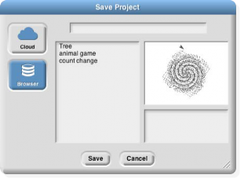

## Local Storage {#local-storage}

There are two different ways to save a project (or a media file such as a costume) on your computer. The reason for this complexity is that Javascript, in which Snap! is implemented, deliberately restricts the ability of programs running in a browser to affect the computer. This is a good thing, because it means that you can confidently run someone else’s Snap! project without worrying that it will delete all your files or infect your computer with a virus. But it does make things a little complicated.

Localstore

Find the File icon () ) in the Tool Bar. In the menu that appears when you click it, choose the option “Save as…” You’ll then see a window like this:

The “Browser” option is selected, which means that your project will be saved in a special file that can be read only on the same computer, by the same browser, connected to the same (Snap!) web page. You won’t see it in a listing of your files outside of Snap!. This is how Javascript protects you against malware in saved projects.

In the picture above, the narrow space at the top is where you enter the name with which you want to save the project. Under that, on the left you see a list of projects you’ve already saved in the browser’s storage. On the right are a picture of the stage and a text box for “project notes”: any information you’d like a user of the project to know. Both of these are saved with the project.

An important limitation of this way to save projects is that your browser will set a limit on the total amount of storage available, for all web sites combined. (This limit may be settable in your browser’s preferences.) So the “localstore” way to save projects (that’s the official name of the browser’s storage) is limited to only a few projects. Also, if your browser is configured to disallow cookies from web sites (another preference setting) then it won’t allow localstore either.

XML Export

The second way to save a project on your computer requires two steps, but it doesn’t have the limitations of localstore. Projects saved in this second way are normal files on your computer and can be shared with friends, can be opened in any browser, and have no size limitation.

From the file menu, choose “Export project…” The entire Snap! window will disappear, replaced by a screenful of what looks like gibberish. Don’t panic! This is what’s supposed to happen. You are looking at your project, in a notation called XML. The main reason it looks like gibberish is that it includes an encoding of the pictures and other media in the project. If you look through the XML, the actual scripts of the project are pretty readable, although they don’t look like Snap! blocks. Snap! has opened a new browser tab for this XML text; the actual Snap! window is still there, hiding in its original tab.

But the point of this XML text isn’t for you to read. Once you’re looking at that tab, use your browser’s Save command (in its File menu, or usually with a shortcut of command-S (Mac) or control-S (everything else). You can choose a filename for it, and it’ll be saved in your usual Downloads folder. You can then close that tab and return to the Snap! tab.