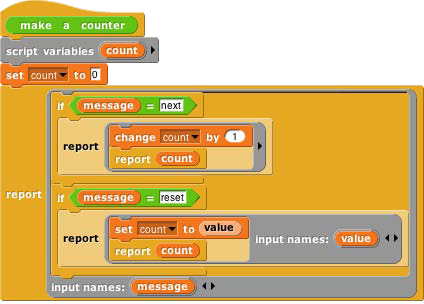
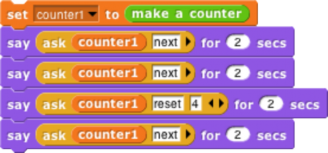

## Messages and Dispatch Procedures {#messages-and-dispatch-procedures}

In the simplified class above, there is only one method, and so there are no messages; you just call the instance to carry out its one method. Here is a more refined version that uses message passing:

Again, the make a counter block represents the counter class, and again the script creates a local variable count each time it is invoked. The large outer ring represents an instance. It is a _dispatch procedure:_ it takes a message (just a text word) as input, and it reports a method. The two smaller rings are the methods. The top one is the next method; the bottom one is the reset method. The latter requires an input, named value.

In the earlier version, calling the instance did the entire job. In this version, calling the instance gives access to a method, which must then be called to finish the job. We can provide a block to do both procedure calls in one:

The ask block has two required inputs: an object and a message. It also accepts optional additional inputs, which Snap! puts in a list; that list is named args inside the block. Ask has two nested call blocks. The inner one calls the object, i.e., the dispatch procedure. The dispatch procedure always takes exactly one input, namely the message. It reports a method, which may take any number of inputs; note that this is the situation in which we drop a list of values onto the arrowheads of a multiple input (in the outer call block). Note also that this is one of the rare cases in which we must unringify the inner call block, whose _value when called_ gives the method.

 