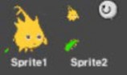
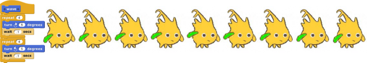

## Nesting Sprites: Anchors and Parts {#nesting-sprites-anchors-and-parts}

Sometimes it’s desirable to make a sort of “super-sprite” composed of pieces that can move together but can also be separately articulated. The classic example is a person’s body made up of a torso, limbs, and a head. Snap! allows one sprite to be designated as the _anchor_ of the combined shape, with other sprites as its _parts._ To set up sprite nesting, drag the sprite corral icon of a _part_ sprite onto the stage display (not the sprite corral icon!) of the desired _anchor_ sprite.

Sprite nesting is shown in the sprite corral icons of both anchors and parts:

In this illustration, it is desired to animate Alonzo’s arm. (The arm has been colored green in this picture to make the relationship of the two sprites clearer, but in a real project they’d be the same color, probably.) Sprite1, representing Alonzo’s body, is the anchor; Sprite2 is the arm. The icon for the anchor shows small images of up to three attached parts at the bottom. The icon for each part shows a small image of the anchor in its top left corner, and a _synchronous rotation flag_ in the top right corner. In its initial setting, as shown above, it means that the when the anchor sprite rotates, the part sprite also rotates as well as revolving around the anchor. When clicked, it changes from a circular arrow to a straight arrow, and indicates that when the anchor sprite rotates, the part sprite revolves around it, but does not rotate, keeping its original orientation. (The part can also be rotated separately, using its turn blocks.) Any change in the position or size of the anchor is always extended to its parts.

