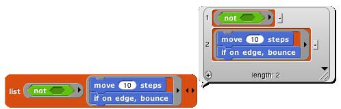
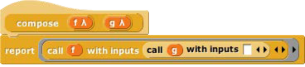

## Procedures as Data {#procedures-as-data}

Here’s an example of a situation in which a procedure must be explicitly marked as data by pulling a ring from the Operators palette and putting the procedure (block or script) inside it:

Here, we are making a list of procedures. But the list block accepts inputs of any type, so its input slots are not ringed. We must say explicitly that we want the block _itself_ as the input, rather than whatever value would result from evaluating the block.

Besides the list block in the example above, other blocks into which you may want to put procedures are set (to set the value of a variable to a procedure), say and think (to display a procedure to the user), and report (for a reporter that reports a procedure):

