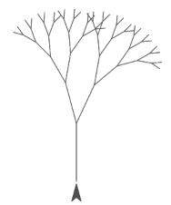
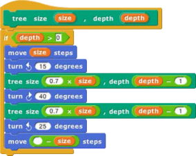
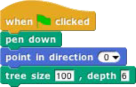
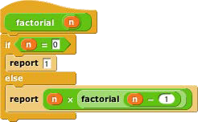
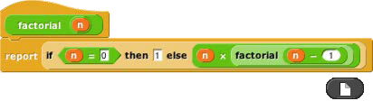

## Recursion {#recursion}

Since the new custom block appears in its palette as soon as you _start_ editing it, you can write recursive blocks (blocks that call themselves) by dragging the block into its own definition:

 

If recursion is new to you, here are a few brief hints: It’s crucial that the recursion have a _base case,_ that is, some small(est) case that the block can handle without using recursion. In this example, it’s the case depth=0, for which the block does nothing at all, because of the enclosing if. Without a base case, the recursion would run forever, calling itself over and over.

Don’t try to trace the exact sequence of steps that the computer follows in a recursive program. Instead, imagine that inside the computer there are many small people, and if Theresa is drawing a tree of size 100, depth 6, she hires Tom to make a tree of size 70, depth 5, and later hires Theo to make another tree of size 70, depth 5\. Tom in turn hires Tammy and Tallulah, and so on. Each little person has his or her own local variables size and depth, each with different values.

 

You can also write recursive reporters, like this block to compute the factorial function:

Note the use of the report block. When a reporter block uses this block, the reporter finishes its work and reports the value given; any further blocks in the script are not evaluated. Thus, the if else block in the script above could have been just an if, with the second report block below it instead of inside it, and the result would be the same, because when the first report is seen in the base case, that finishes the block invocation, and the

second report is ignored. There is also a stop block block that has a similar purpose, ending the block invocation early, for command blocks. (By contrast, the stop script block stops not only the current block invocation, but also the entire toplevel script that called it.)

Here’s a slightly more compact way to write the factorial function:

(If you don’t see the reporter-if block in the Control palette, click the file button in the tool bar and choose “Import tools.”)

For more on recursion, see _Thinking Recursively_ by Eric Roberts. (The original edition is ISBN 978-0471816522; a more recent _Thinking Recursively in Java_ is ISBN 978-0471701460.)