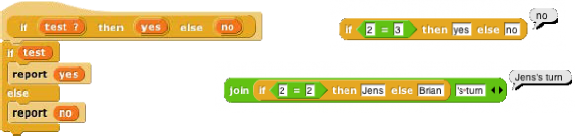
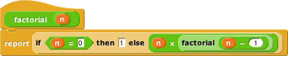
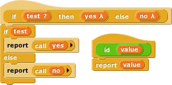
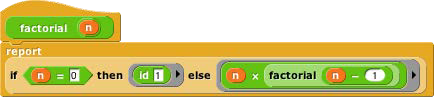

## Special Forms {#special-forms}

The primitive if else block has two C-shaped command slots and chooses one or the other depending on a Boolean test. Because Scratch doesn’t emphasize functional programming, it lacks a corresponding reporter block to choose between two expressions. We could write one in Snap!:

Our block works for these simple examples, but if we try to use it in writing a recursive operator, it’ll fail:

The problem is that when any block is called, all of its inputs are computed (evaluated) before the block itself runs. The block itself only knows the values of its inputs, not what expressions were used to compute them. In particular, all of the inputs to our if then else block are evaluated first thing. That means that even in the base case, factorial will try to call itself recursively, causing an infinite loop. We need our if then else block to be able to select only one of the two alternatives to be evaluated.

We have a mechanism to allow that: declare the then and else inputs to be of type Reporter rather than type Any. Then, when calling the block, those inputs will be enclosed in a ring so that the expressions themselves, rather than their values, become the inputs:

 

In this version, the program works, with no infinite loop. But we’ve paid a heavy price: this reporter-if is no longer as intuitively obvious as the Scratch command-if. You have to know about procedures as data, about rings, and about a trick to get a constant value in a ringed slot. (The id block implements the identity function, which reports its input. We need it because rings only take reporters as input, not numbers.) What we’d like is a reporter-if that _behaves_ like this one, delaying the evaluation of its inputs, but _looks_ like our first version, which was easy to use except that it didn’t work.

Such blocks are indeed possible. A block that seems to take a simple expression as input, but delays the evaluation of that input by wrapping an “invisible ring” around it (and, if necessary, an id-like transformation of constant data into constant functions) is called a _special form_. To turn our if block into a special form, we edit the block’s prototype, declaring the inputs yes and no to be of type “Any (unevaluated)” instead of type Reporter. The script for the block is still that of the second version, including the use of call to evaluate either yes or no but not both. But the slots appear as white Any-type rectangles, not Reporter-type rings, and the factorial block will look like our first attempt.

In a special form’s prototype, the unevaluated input slot(s) are indicated by a lambda (λ) next to the input name, just as if they were declared as Procedure type. They _are_ Procedure type, really; they’re just disguised to the user of the block.

Special forms trade off implementor sophistication for user sophistication. That is, you have to understand all about procedures as data to make sense of the special form implementation of if then else. But any experienced Scratch programmer can _use_ if then else without thinking at all about how it works internally.

Special Forms in Scratch

Special forms are actually not a new invention in Snap!. Many of Scratch’s conditional and looping blocks are really special forms. The hexagonal input slot in the if block is a straightforward Boolean value, because the value can be computed once, before the if block makes its decision about whether or not to run its action input. But the forever if, repeat until, and wait until blocks’ inputs can’t be Booleans; they have to be of type “Boolean (unevaluated),” so that Scratch can evaluate them over and over again. Since Scratch doesn’t have custom blocks, it can afford to handwave away the distinction between evaluated and unevaluated Booleans, but Snap! can’t. The pedagogic value of special forms is proven by the fact that no Scratcher ever notices that there’s anything strange about the way in which the hexagonal inputs in the Control blocks are evaluated.

Also, the C-shaped slot familiar to Scratch users is an unevaluated procedure type; you don’t have to use a ring to keep the commands in the C-slot from being run before the C-shaped block is run. Those commands themselves, not the result of running them, are the input to the C-shaped Control block. (This is taken for granted by Scratch users, especially because Commands don’t report values, so it wouldn’t make sense to think of putting commands in the C-shaped slot as a composition of functions.) This is why it makes sense that

“C-shaped” is on the fourth row of types in the long form input dialog, with other unevaluated types.

*   Object Oriented Programming

    Object oriented programming is a style based around the abstraction _object:_ a collection of _data_ and _methods_ (procedures, which from our point of view are just more data) that you interact with by sending it a _message_ (just a name, maybe in the form of a text string, and perhaps additional inputs). The object responds to the message by carrying out a method, which may or may not report a value back to the asker. Some people emphasize the _data hiding_ aspect of OOP (because each object has local variables that other objects can access only by sending request messages to the owning object) while others emphasize the _simulation_ aspect (in which each object abstractly represents something in the world, and the interactions of objects in the program model real interactions of real people or things). Data hiding is important for large multi-programmer industrial projects, but for Snap! users it’s the simulation aspect that’s important. Our approach is therefore less restrictive than that of some other OOP languages.

    Technically, object oriented programming rests on three legs: (1) _Message passing:_ There is a notation by which any object can send a message to another object. (2) _Local state:_ Each object can remember the important past history of the computation it has performed. (“Important” means that it need not remember every message it has handled, but only the lasting effects of those messages that will affect later computation.) (3) _Inheritance:_ It would be impractical if each individual object had to contain methods, many of them identical to those of other objects, for all of the messages it can accept. Instead, we need a way to say that this new object is just like that old object except for a few differences, so that only those differences need be programmed explicitly.

    The idea of object oriented programming is often taught in a way that makes it seem as if a special object oriented programming language is necessary. In fact, any language with first class procedures allows objects to be implemented explicitly; this is a useful exercise to help demystify objects.

    The central idea of this implementation is that an object is represented as a _dispatch procedure_ that takes a message as input and reports the corresponding method. In this section we start with a stripped-down example to show how local state works, and build up to full implementations of class/instance and prototyping OOP.