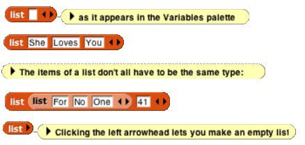
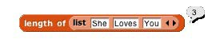
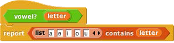
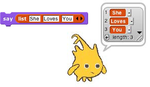

## The list Block {#the-list-block}

At the heart of providing first class lists is the ability to make an “anonymous” list—to make a list without simultaneously giving it a name. The list reporter block does that.

At the right end of the block are two left-and-right arrowheads. Clicking on these changes the number of inputs to list, i.e., the number of elements in the list you are building.

You can use this block as input to many other blocks:

Snap! does not have a “Make a list” button like the one in Scratch. If you want a global named list, make a global variable and use the set block to put a list into the variable.