## The Scripting Area {#the-scripting-area}

The scripting area is the middle vertical region of the Snap!window, containing scripts and also some controls for the appearance and behavior of a sprite. There is always a _current sprite,_ whose scripts are shown in the scripting area. A dark grey rounded rectangle in the sprite corral shows which sprite (or the stage) is current. Note that it’s only the visible _display_ of the scripting area that is “current” for a sprite; all scripts of all sprites may be running at the same time. Clicking on a sprite thumbnail in the sprite corral makes it current. The stage itself can be selected as current, in which case the appearance is slightly different.

Sprite Appearance and Behavior Controls

At the top of the scripting area are a picture of the sprite and some controls for it:

Note that the sprite picture reflects its rotation, if any. There are three things that can be controlled here:

The three circular buttons in a column at the left control the sprite’s _rotation_ behavior. Sprite costumes are designed to be right-side-up when the sprite is facing toward the right (direction = 90). If the topmost button is lit, the default as shown in the picture above, then the sprite’s costume rotates as the sprite changes direction. If the middle button is selected, then the costume is reversed left-right when the sprite’s direction is roughly leftward (direction between 180 and 359, or equivalently, between -180 and -1). If the bottom button is selected, the costume’s orientation does not change regardless of the sprite’s direction.

The sprite’s _name_ can be changed in the text box that, in this picture, says “Sprite.”

Finally, if the draggable checkbox is checked, then the user can move the sprite on the stage by clicking and dragging it. The common use of this feature is in game projects, in which some sprites are meant to be under the player’s control but others are not.

Scripting Area Tabs

Just below the sprite controls are three _tabs_ that determine what is shown in the scripting area:

Scripts and Blocks Within Scripts

Most of what’s described in this section also applies to blocks and scripts in a Block Editor.

Clicking on a script (which includes a single unattached block) runs it. If the script starts with a hat block, clicking on the script runs it even if the event in the hat block doesn’t happen. (This is a useful debugging technique when you have a dozen sprites and they each have five scripts with green-flag hat blocks, and you want to know what a single one of those scripts does.) The script will have a green “halo” around it while it’s running. Clicking a script with such a halo _stops_ the script. (If the script includes a warp block, which might be inside a custom block used in the script, then Snap! may not respond immediately to clicks. Hold the mouse button down until it works.)

If a script is shown with a _red_ halo, that means that an error was caught in that script, such as using a list where a number was needed, or vice versa. Clicking the script will turn off the halo.

Control-click/right-clicking a primitive block within a script shows a menu like this one:

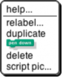

The help… option shows the help screen for the block, just as in the palette. The other options appear only when a block is right-clicked/control-clicked in the scripting area.

Not every primitive block has a relabel… option. When present, it allows the block to be replaced by another, similar block, keeping the input expressions in place. For example, here’s what happens when you choose relabel… for an arithmetic operator:

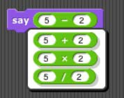

Note that the inputs to the existing – block are displayed in the menu of alternatives also. Click a block in the menu to choose it, or click outside the menu to keep the original block.

The duplicate option makes a copy of the _entire script_ starting from the selected block. The copy is attached to the mouse, and you can drag it to another script (or even to another Block Editor window), even though you are no longer holding down the mouse button. Click the mouse to drop the script copy.

The block picture underneath the word duplicate is another duplication option, but it duplicates only the selected block, not everything under it in the script. Note that if the selected block is a C-shaped control block, the script inside its C-shaped slot is included. If the block is at the end of its script, this option does not appear.

The delete option deletes the selected block from the script.

The script pic… option opens a new browser tab containing a picture of the entire script, not just from the selected block to the end. You can use the browser’s Save feature to put the picture in a file. This is a super useful feature if you happen to be writing a Snap! manual!

If the script does _not_ start with a hat block, or you clicked on a reporter, then there’s one more option: ringify or, if there is already a grey ring around the block or script, unringify. Ringify surrounds the block (reporter) or the entire script (command) with a grey ring, meaning that the block(s) inside the ring are themselves data, as an input to a higher order procedure, rather than something to be evaluated within the script. See Section VI, Procedures as Data.

Clicking a _custom_ block in a script gives a similar but different menu:

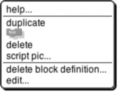

There is no relabel… option for custom blocks. The two options at the bottom, for custom blocks only, are the same as in the palette.

Scripting Area Background Context Menu

Control-click/shift-click on the grey striped background of the scripting area gives this menu:

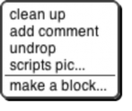

The clean up option rearranges the position of scripts so that they are in a single column, with the same left margin, and with uniform spacing between scripts. This is a good idea if you can’t read your own project!

The add comment option puts a comment box like the picture below in the scripting area. It’s attached to the mouse, as with duplicating scripts, so you position the mouse where you want the comment and click to release it. You can then edit the text in the comment as desired.

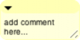

You can drag the bottom right corner of the comment box to resize it. Clicking the arrowhead at the top left changes the box to a single-line compact form, as below, so that you can have a number of collapsed comments in the scripting area and just expand one of them when you want to read it in full.

If you drag a comment over a block in a script, the comment will be attached to the block with a yellow line:

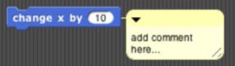

Comments have their own context menu, with obvious meanings:

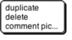

Back to the options in the menu for the background of the scripting area:

The undrop option is a sort of “undo” feature for the common case of dropping a block somewhere other than where you meant it to go. It reattaches the dropped block or script to the mouse, like duplicating a block, and restores the former contents of the slot into which you dropped it. You can then reposition the mouse to put the block where you meant it to go.

The scripts pic… option opens a new browser tab with a picture of _all_ scripts in the scripting area, just as they appear, but without the grey striped background. Note that “all scripts in the scripting area” means just the top- level scripts of the current sprite, not other sprites’ scripts or custom block definitions.

Finally, the make a block… option does the same thing as the “Make a block” button in the Variables palette. It’s a shortcut so that you don’t have to keep switching to Variables if you make a lot of blocks.

Controls in the Costumes Tab

If you click on the word “Costumes” under the sprite controls, you’ll see something like this:

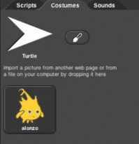

The Turtle costume is always present in every sprite; it is costume number 0\. Other costumes can be painted within Snap! or imported from files or other browser tabs if your browser supports that. Clicking on a costume selects it; that is, the sprite will look like the selected costume. Clicking on the paint brush icon opens the

Paint Editor, in which you can create a new costume.

Control-clicking/right-clicking on the turtle picture gives this menu:

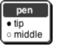

In this menu, you choose the turtle’s _rotation point,_ which is also the point from which the turtle draws lines. The two pictures below show what the stage looks like after drawing a square in each mode; tip (otherwise known as “Jens mode”) is on the left, middle (“Brian mode”) on the right:

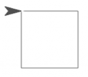 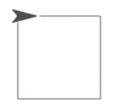

As you see, “tip” means the front tip of the arrowhead; “middle” is not the middle of the shaded region, but actually the middle of the four vertices, the concave one. (If the shape were a simple isosceles triangle instead of a fancier arrowhead, it would mean the midpoint of the back edge.) The advantage of tip mode is that the sprite is less likely to obscure the drawing. The advantage of middle mode is that the rotation point of a sprite is rarely at a tip, and students are perhaps less likely to be confused about just what will happen if you ask the turtle to turn 90 degrees from the position shown. (It’s also the traditional rotation point of the Logo turtle, which originated this style of drawing.)

Costumes other than the turtle have a different context menu:

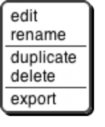

The edit option opens the Paint Editor on this costume. The rename option opens a dialog box in which you can rename the costume. (A costume’s initial name comes from the file from which it was imported, if any, or is something like costume5.) Duplicate makes a copy of the costume, in the same sprite. (Presumably you’d do that because you intend to edit one of the copies.) Delete is obvious. The export option opens a new browser tab with a picture of the costume. You can then save it to a file, or select a different sprite in the Snap! tab, return to the picture tab, and drag the costume onto the Snap! tab to copy the costume to another sprite.

You can drag costumes up and down in the Costumes tab in order to renumber them, so that next costume

will behave as you prefer.

The Paint Editor

Here is a picture of a Paint Editor window:

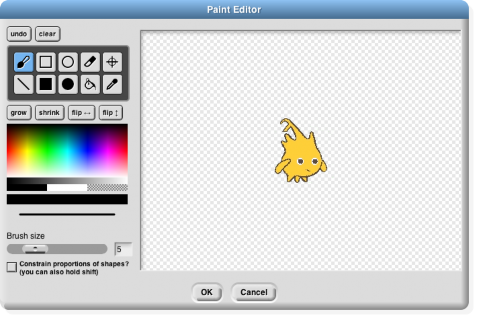

If you’ve used any painting program, most of this will be familiar to you. Currently only bitmap costumes (jpg, png, etc.) can be edited, not vector costumes (svg, etc.). Unlike the case of the Block Editor, only one Paint Editor window can be open at a time.

The ten square buttons in two rows of five near the top left of the window are the _tools._ The top row, from left to right, are the paintbrush tool, the outlined rectangle tool, the outlined ellipse tool, the eraser tool, and the rotation point tool. The bottom row tools are the line drawing tool, the solid rectangle tool, the solid ellipse tool, the floodfill tool, and the eyedropper tool. Below the tools is a row of four buttons that immediately change the picture. The first two change its overall size; the next two flip the picture around horizontally or vertically.

Below these are a color palette, a greyscale tape, and larger buttons for black, white, and transparent paint. Below these is a solid bar displaying the currently selected color. Below that is a picture of a line showing the brush width for painting and drawing, and below that, you can set the width either with a slider or by typing a number (in pixels) into the text box. Finally, the checkbox constrains the line tool to draw horizontally or vertically, the rectangle tools to draw squares, and the ellipse tools to draw circles. You can get the same effect temporarily by holding down the shift key, which makes a check appear in the box as long as you hold it down. (But the Caps Lock key doesn’t affect it.)

You can correct errors with the undo button, which removes the last thing you drew, or the clear button, which erases the entire picture. (Note, it does _not_ revert to what the costume looked like before you started editing it! If that’s what you want, click the Cancel button at the bottom of the editor.) When you’re finished editing, to keep your changes, click OK.

Note that the ellipse tools work more intuitively than ones in other software you may have used. Instead of dragging between opposite corners of the rectangle circumscribing the ellipse you want, so that the endpoints of your dragging have no obvious connection to the actual shape, in Snap! you start at the center of the ellipse you want and drag out to the edge. When you let go of the button, the mouse cursor will be on the curve. If you drag out from the center at 45 degrees to the axes, the resulting curve will be a circle; if you drag more horizontally or vertically, the ellipse will be more eccentric. (Of course if you want an exact circle you can hold down the shift key or check the checkbox.) The rectangle tools, though, work the way you expect: You start at one corner of the desired rectangle and drag to the opposite corner.

Using the eyedropper tool, you can click anywhere in the Snap! window, even outside the Paint Editor, and the tool will select the color at the mouse cursor for use in the Paint Editor. You can only do this once, because the Paint Editor automatically selects the paintbrush when you choose a color. (Of course you can click on the eyedropper tool button again.)

The only other non-obvious tool is the rotation point tool. It shows in the Paint Editor where the sprite’s current rotation center is (the point around which it turns when you use a turn block); if you click or drag in the picture, the rotation point will move where you click. (You’d want to do this, for example, if you want a character to be able to wave its arm, so you use two sprites connected together. You want the rotation point of the arm sprite to be at the end where it joins the body, so it remains attached to the shoulder while waving.)

Controls in the Sounds Tab

There is no Sound Editor in Snap!, and also no current sound the way there’s a current costume for each sprite. (The sprite always has an appearance unless hidden, but it doesn’t sing unless explicitly asked.) So the context menu for sounds has only rename and delete options, and it has a clickable button labeled Play or Stop [as appropriate. If you need a sound editor, consider](http://audacity.sourceforge.net/) [http://audacity.sourceforge.net](http://audacity.sourceforge.net/)[.](http://audacity.sourceforge.net/)