## The Snap! Input Type Dialog {#the-snap-input-type-dialog}

In the Block Editor input name dialog, there is a right-facing arrowhead after the “Input name” option:

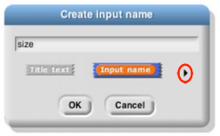

Clicking that arrowhead opens the “long” input name dialog:

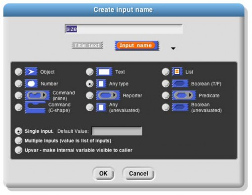

There are twelve input type shapes, plus three mutually exclusive categories, listed in addition to the basic choice between title text and an input name. The default type, the one you get if you don’t choose anything

else, is “Any,” meaning that this input slot is meant to accept any value of any type. If the size input in your block should be an oval-shaped numeric slot rather than a generic rectangle, click “Number.”

The arrangement of the input types is systematic. As the pictures on this and the next page show, each row of types is a category, and parts of each column form a category. Understanding the arrangement will make it a little easier to find the type you want.

The second row of input types contains the ones found in Scratch: Number, Any, and Boolean. (The reason these are in the second row rather than the first will become clear when we look at the column arrangement.) The first row contains the new Snap! types other than procedures: Object, Text, and List. The last two rows are the types related to procedures, discussed more fully below.

The List type is used for first class lists, discussed in Section IV above. The red rectangles inside the input slot are meant to resemble the appearance of lists as Snap! displays them on the stage: each element in a red rectangle.

The Object type is reserved for first class sprites, coming in Snap! 4.1.

The Text type is really just a variant form of the Any type, using a shape that suggests a text input.1

Procedure Types

Although the procedure types are discussed more fully later, they are the key to understanding the column arrangement in the input types. Like Scratch, Snap! has three block shapes: jigsaw-piece for command blocks, oval for reporters, and hexagonal for predicates. (A _predicate_ is a reporter that always reports true or false.) In Snap! these blocks are first class data; an input to a block can be of Command type, Reporter type, or Predicate type. Each of these types is directly below the type of value that that kind of block reports, except for Commands, which don’t report a value at all. Thus, oval Reporters are related to the Any type, while hexagonal Predicates are related to the Boolean (true or false) type.

1 In Scratch, every block that takes a Text-type input has a default value that makes the rectangles for text wider than tall. The blocks that aren’t specifically about text either are of Number type or have no default value, so those rectangles are taller than wide. At first we thought that Text was a separate type that always had a wide input slot; it turns out that this isn’t true in Scratch (delete the default text and the rectangle narrows), but we thought it a good idea anyway, so we allow Text-shaped boxes even for empty input slots. (This is why Text comes just above Any in the input type selection box.)

The unevaluated procedure types in the fourth row are explained in Section VI.E below. In one handwavy sentence, they combine the _meaning_ of the procedure types with the _appearance_ of the reported value types two rows higher. (Of course, this isn’t quite right for the C-shaped command input type, since commands don’t report values. But you’ll see later that it’s true in spirit.)

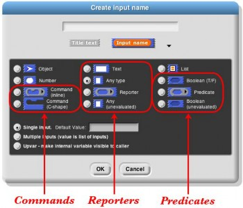

Pulldown inputs

Certain primitive blocks have _pulldown_ inputs, either _read-only,_ like the input to the touching block:

(indicated by the input slot being the same (blue, in this case) color as the body of the block), or _writeable,_ like the input to the point in direction block:

(indicated by the white input slot), which means that the user can enter an arbitrary input instead of using the pulldown menu.

Custom blocks can also have such inputs. This is an experimental feature, and the user interface is likely to change! To make a pulldown input, open the long form input dialog and control-click/right-click in the dark grey area. You will see this menu:

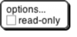

Click the checkbox if you want a read-only pulldown input. Then control-click/right-click again and choose

### options… to get this dialog box: {#options-to-get-this-dialog-box}

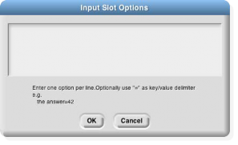

For now, at least, you can have only fixed options, not, for example, “all sprites,” let alone “all sprites that are on the left half of the stage right now.”

Input variants

We now turn to the three mutually exclusive options that come below the type array.

The “Single input” option: In Scratch all inputs are in this category. There is one input slot in the block as it appears in its palette. If a single input is of type Any, Number, or Text, then you can specify a default value that will be shown in that slot in the palette, like the “10” in the move (10) steps block. In the prototype block at the top of the script in the Block editor, an input with name “size” and default value 10 looks like this:

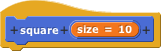

The “Multiple inputs” option: The list block introduced earlier accepts any number of inputs to specify the items of the new list. To allow this, Snap! introduces the arrowhead notation () that expands and contracts the block, adding and removing input slots. Custom blocks made by the Snap! user have that capability, too. If you choose the “Multiple inputs” button, then arrowheads will appear after the input slot in the block. More or fewer slots (as few as zero) may be used. When the block runs, all of the values in all of the slots for this input name are collected into a list, and the value of the input as seen inside the script is that list of values:

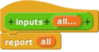

 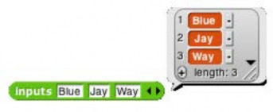

The ellipsis (…) in the orange input slot name box in the prototype indicates a Multiple input.

The third category, “Upvar - make internal variable visible to caller,” isn’t really an input at all, but rather a sort of output from the block to its user. It appears as an orange variable oval in the block, rather than as an input slot. Here’s an example; the uparrow (↑) in the prototype indicates this kind of internal variable name:

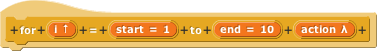 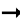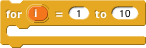

The variable i (in the block on the right above) can be dragged from the for block into the blocks used in its C- shaped command slot. Also, by clicking on the orange i, the user can change the name of the variable as seen in the calling script (although the name hasn’t changed inside the block’s definition). This kind of variable is called an _upvar_ for short, because it is passed _upward_ from the custom block to the script that uses it.

Prototype Hints

We have noted three notations that can appear in an input slot in the prototype to remind you of what kind of input this is. Here is the complete list of such notations:

| = default value | … multiple inputs ↑ | upvar |
| --- | --- | --- |
| λ procedure types | ⫶ list ? | Boolean |

Title Text and Symbols

Some primitive blocks have symbols as part of the block name: Custom blocks can use symbols too. In the Block Editor, click the plus sign in the prototype at the point where you want to insert the

symbol. Then click the title text picture below the text box that’s expecting an input slot name. The dialog will then change to look like this:

The important part to notice is the arrowhead that has appeared at the right end of the text box. Click it to see this menu:

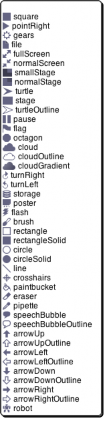

Choose one of the symbols. The result will look kind of ugly in the prototype:

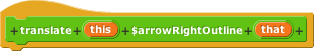

but the actual block will have the symbol you want:

The available symbols are, pretty much, the ones that are used in Snap! icons. But I’d like the arrow symbol bigger, and yellow, so I edit its name:

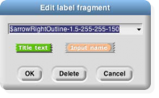

This says to make the symbol 1.5 times as big as the letters in the block text, using a color with red-green-blue values of 255-255-150 (each between 0 and 255). Here’s the result:

*   Procedures as Data