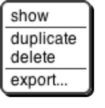

## The Sprite Corral and Sprite Creation Buttons {#the-sprite-corral-and-sprite-creation-buttons}

Between the stage and the sprite corral at the bottom right of the Snap! window is a dark grey bar containing two buttons. These are used to create a new sprite. The first button makes a sprite with just the turtle costume; the second button makes a sprite and opens the Paint Editor so that you can make your own costume for it. (Of course you could click the first button and then click the paint button in its costumes tab; this paint button is a shortcut for all that.)

In the sprite corral, you click on a sprite’s “thumbnail” picture to select that sprite (to make it the one whose scripts, costumes, etc. are shown in the scripting area). You can drag sprite thumbnails (but not the stage one) to reorder them; this has no special effect on your project, but lets you put related ones next to each other, for example. You can right-click/control-click a sprite’s thumbnail to get this context menu:

The show option makes the sprite visible, if it was hidden, and also brings it onto the stage, if it had moved past the stage boundary. The other three options are the same as in the context menu of the actual sprite on the stage, discussed above.

The context menu for the stage thumbnail has only one option, pic…, which takes a picture of everything on the stage, just like the same option in the context menu of the stage background.

Index

#

# variable · 60

A

Abelson, Hal · 3

About option · 57

add comment option · 68 AGPL · 57

all but first of block · 25 Alonzo · 7

anchor · 8

animation · 10 anonymous list · 22

Any (unevaluated) type · 39 Any type · 28

append · 60

arithmetic · 9 array, dynamic · 25

arrow, upward-pointing · 30 arrowheads · 22, 30

ask block · 42 association list · 44 associative function · 26

B

Ball. Michael · 3 base case · 20 binary tree · 23 block · 5

command · 5

hat · 5

predicate · 10

reporter · 8

Block Editor · 18, 19, 27 block library · 60

block picture option · 68 block shapes · 17, 28 blocks, color of · 17 Boole, George · 10 Boolean · 10

Boolean (unevaluated) type · 39 break command · 55 breakpoint · 64

broadcast and wait block · 7

Browser button · 58

Build Your Own Blocks · 17

C

call block · 32, 35

call w/continuation block · 53

Cancel button · 72

cascade · 60

catch · 55 Chandra, Kartik · 3

Change password… · 61 child class · 43

Church, Alonzo · 7 class · 41

clean up option · 68 clear button · 72 clicking on a script · 67 Clicking sound · 63 clone of block · 45 Cloud button · 58 cloud icon · 61

Codification support · 64 color of blocks · 17

color palette · 71 combine block · 26 command block · 5 comment box · 68 compose · 60

constant functions · 39

context menu for the palette background · 66 context menus for palette blocks · 65 continuation · 49

continuation passing style · 50 Control palette · 5

controls in the Costumes tab · 70 controls in the Sounds tab · 72 controls on the stage · 72 costume · 5, 6

Costumes tab · 7, 70 counter class · 41 CPS · 52

crossproduct · 37

C-shaped block · 5, 34 C-shaped slot · 39 current · 48

current date or time · 48 current sprite · 66

custom block in a script · 68

D

data hiding · 40 data structure · 23 data types · 27 date · 48

Dave, Achal · 3 debugging · 64 default value · 30 delegation · 43 Delete a variable · 13

delete block definition… option · 66

delete option · 68, 71, 73

design principle · 22 devices · 47

dialog, input name · 19 Dinsmore, Nathan · 3

dispatch procedure · 40, 42, 44 Download source option · 58 draggable checkbox · 66 duplicate option · 67, 71, 72 dynamic array · 25

E

edit option · 71, 73 edit… option · 66 ellipse tool · 71, 72

ellipsis · 30

empty input slots, filling · 33, 35, 37 eraser tool · 71

Examples button · 59 Execute on slider change · 63 Export blocks… option · 60 export option · 71, 73 Export project… option · 59 expression · 9

eyedropper tool · 71, 72

F

factorial · 20, 38 File button · 10 file icon menu · 58

first class data type · 22 flag, green · 5

Flat design · 63 floodfill tool, · 71 for block · 11, 31

function, associative · 26 functional programming style · 24

G

global variable · 13 green flag · 5, 64 green halo · 67 grey dot · 7

H

halo · 9, 67

hat block · 5, 18

help… option · 65, 67

help… option for custom block · 65 hexagonal blocks · 17, 28 hexagonal shape · 10

hide option · 65

hide primitives option · 66 higher order function · 37 higher order procedure · 33 Hotchkiss. Kyle · 3

http:// block · 47 Hudson, Connor · 3

I

icons in title text · 31

id block · 39

identity function · 39

if block · 10

if else block · 38

imperative programming style · 24 Import tools · 10

Import tools option · 60

Import… option · 59 in front of block · 25 Ingalls, Dan · 3 inheritance · 40, 43

input · 5 input list · 35

input name dialog · 19, 27

Input sliders · 62 input-type shapes · 27 _instance_ · 41

interaction · 13 internal variable · 30 item 1 of block · 25 iteration library · 60

J

jigsaw-piece blocks · 17, 28

jukebox · 7

K

Kay, Alan · 3 keep block · 25 key-value pair · 44

L

lambda · 34 Language… option · 62 layout, window · 4 Libraries… option · 60 license · 57

Lifelong Kindergarten Group · 3 line drawing tool · 71

linked list · 25 list block · 22 list library · 60

list of procedures · 38 List type · 28

list, linked · 25 lists of lists · 23 local state · 40 Login… · 61

Logout · 61

Long form input dialog · 62 long input name dialog · 27

M

Make a block · 17

make a block… option · 69 Make a list · 22

Make a variable · 12

make internal variable visible · 30 Maloney, John · 3

map block · 26, 32

Massachusetts Institute of Technology · 3 McCarthy, John · 3

Media Lab · 3 message · 40

message passing · 40, 42

method · 40, 42

middle · 70

MIT Artificial Intelligence Lab · 3 MIT Media Lab · 3

Morphic · 3 Motyashov, Ivan · 3 Multiple inputs · 30

N

nested calls · 37 Nesting Sprites · 8 New option · 58

new sprite button · 6 nonlocal exit · 55 Number type · 28

O

object oriented programming · 40 Object type · 28

objects, building explicitly · 41

Open… option · 58 orange oval · 11 outlined ellipse tool · 71

outlined rectangle tool · 71 oval blocks · 17, 28

P

paint brush icon · 70 Paint Editor · 70

Paint Editor window · 71 paintbrush tool · 71

palette · 5 palette area · 65

palette background · 66 parallelism · 6

parent class · 43

parts (of nested sprite) · 8

pause block · 64 pause button · 64 physical devices · 47 pic… option · 73

Plain prototype labels · 62 Predicate block · 10

Prefer smooth animations · 63 presentation mode button · 64 primitive block within a script · 67 procedure · 10, 33

project control buttons · 64 Project notes option · 58 prototype · 18

prototyping · 43 pulldown inputs · 29

R

rectangle tool · 71 recursion · 20 recursive call · 35 recursive operator · 38 red halo · 35, 67

Reference manual option · 58

relabel… option · 67 remove duplicates from · 60 rename option · 71

repeat block · 5, 34 repeat blocks · 60 repeat until block · 10 report block · 20 Reporter block · 8 reporter if block · 10 reporters, recursive · 20 Reset Password… · 61 reverse · 60

Reynolds, Ian · 3 ring · 33, 35

ringify · 33, 68 Roberts, Eric · 21 robots · 47

rotation · 66

rotation point tool · 71, 72

run · 35

run w/continuation · 55

S

Save as… option · 59 Save option · 59 Scheme · 3

Scratch · 4, 7, 17, 22, 23, 24, 27

Scratch Team · 3 script · 4

script pic… · 68

script variables block · 13, 41 scripting area · 5, 66

scripting area background context menu · 68

scripts pic… option · 69 sensors · 47

sentence library · 61 set block · 13 settings icon · 62 shapes of blocks · 17 Share · 59

shortcut · 69, 73 show all option · 73 show option · 73

show primitives option · 66 shrink/grow button · 64 sieve · 60

Signup… · 61

simulation · 40 Single input · 30 Snap!logo menu · 57 Snap! program · 4

Snap! website option · 58 snap.berkeley.edu · 58 solid ellipse tool · 71

solid rectangle tool · 71

sort · 60

source files for Snap! · 58 special form · 39

split block · 47

sprite · 5

sprite appearance and behavior controls · 66 sprite corral · 6, 73

sprite creation buttons · 73 sprite nesting · 8

squiral · 11

stack of blocks · 5 stage · 5

Stage resizing buttons · 64

Stanford Artificial Intelligence Lab · 3 Steele, Guy · 3

stop block block · 21 stop button · 64 stop sign · 6

stream library · 60

Structure and Interpretation of Computer Programs · 3 Sussman, Gerald J. · 3

Sussman, Julie · 3 symbols in title text · 31

T

text input · 7 Text type · 28

text-based language · 64 _Thinking Recursively_ · 21 thread · 56

Thread safe scripts · 63 thumbnail · 66

time · 48

tip · 70

title text · 19 tool bar · 5

tool bar features · 57 tools library · 4, 11, 25

translation · 62 Turbo mode · 63 Turtle costume · 70

turtle’s rotation point · 70

U

undo button · 72

undrop option · 69

unevaluated procedure types · 29 unringify · 33, 42, 68

Unshare · 59

upvar · 31

upward-pointing arrow · 30 user interface elements · 57

V

variable · 11 variable watcher · 13

variable-input slot · 35 variadic library · 61

W

wardrobe · 7

watcher · 13 window layout · 4 with inputs · 33

word and sentence library · 61 World Wide Web · 47 writeable pulldown inputs · 29

X

X position · 9 Xerox PARC · 3

Y

Y position · 9 Yuan, Yuan · 3

Z

zebra coloring · 9

Zoom blocks.,. option · 62