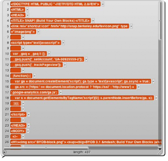

## The World Wide Web {#the-world-wide-web}

The input to the http:// block is the URL (Uniform Resource Locator) of a web page. The block reports the body of the Web server’s response (minus HTTP header), _without interpretation._ This means that in most cases the response is a description of the page in HTML (HyperText Markup Language) notation. Often, especially for commercial web sites, the actual information you’re trying to find on the page is actually at another URL included in the reported HTML. The Web page is typically a very long text string, and so the primitive split block is useful to get the text in a manageable form, namely, as a list of lines:

The second input to split is the character to be used to separate the text string into a list of lines, or one of a set of common cases (such as line, which separates on carriage return and/or newline characters.

This might be a good place for a reminder that list watchers scroll through only 100 items at a time. The downarrow near the bottom right corner of the speech balloon in the picture presents a menu of hundred-item ranges. (This may seem unnecessary, since the scroll bar should allow for any number of items, but doing it this way makes Snap! much faster.)

There are two important restrictions on the use of the http:// block to examine arbitrary Web sites. First, it is limited to HTTP, not the more secure HTTPS that encrypts the information sent to and from the site, and so you can’t use Snap! for anything that requires sending passwords. (This is probably just as well.)

Second, a security restriction in Javascript limits the ability of one web site to initiate communication with another site. There is an official workaround for this limitation called the CORS protocol (Cross-Origin Resource Sharing), but the target site has to allow snap.berkeley.edu explicitly, and of course most don’t. To get around this problem, you can use third-party sites that are not limited by Javascript and that forward your requests. An example is corsproxy.com; it works this way:

