## Tool Bar Features {#tool-bar-features}

Holding down the Shift key while clicking on any of the menu buttons gives access to an extended menu with options, shown in red, that are experimental or for use by the developers. We’re not listing those extra options here because they change frequently and you shouldn’t rely on them. But they’re not secrets.

The Snap! Logo Menu

The Snap! logo at the left end of the tool bar is clickable. It shows a menu of options about Snap! itself:

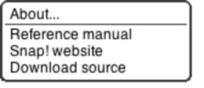

The About option displays information about Snap! itself, including version numbers for the source modules, the implementors, and the license (AGPL: you can do anything with it except create proprietary versions, basically).

The Reference manual option downloads a copy of the latest revision of this manual in PDF format.

The Snap! website option opens a browser window pointing to snap.berkeley.edu, the web site for Snap!.

The Download source option downloads, to your browser’s usual download directory, a zip file containing the Javascript source files for Snap!. You can read the code to learn how Snap! is implemented, host a copy on your own computer (this is one way to keep working while on an airplane), or make a modified version with customized features. (However, access to cloud accounts is limited to the official version hosted at Berkeley.)

The File Menu

The file icon shows a menu mostly about saving and loading projects:

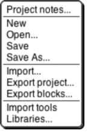

The Project notes option opens a window in which you can type notes about the project: How to use it, what it does, whose project you modified to create it, if any, what other sources of ideas you used, or any other information about the project. This text is saved with the project, and is useful if you share it with other users.

The New option starts a new, empty project. Any project you were working on before disappears, so you are asked to confirm that this is really what you want. (It disappears only from the current working Snap!window; you should save the current project, if you want to keep it, before using New.)

The Open… option shows a project open dialog box in which you can choose a project to open:

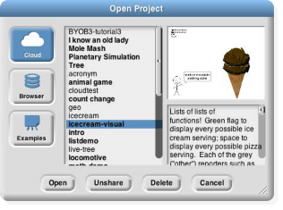

In this dialog, the three large buttons at the left select a source of projects: Cloud means your Snap!account’s cloud storage; Browser means your browser’s localstore (data accessible only in that browser, on that computer,

by that user); Examples means a collection of sample projects we provide. The text box to the right of those buttons is an alphabetical listing of projects from that source; selecting a project by clicking shows its thumbnail (a picture of the stage when it was saved) and its project notes at the right.

The four buttons at the bottom select an action to perform on the selected project. The first button, Open, loads the project into Snap!and closes the dialog box. The second button (only if Cloud is the source) is labeled either Share or Unshare; a shared project can be read (but not modified) by any Snap!user, not only by you. Shared projects are indicated in **boldface** in the project listing box. The next button (if Cloud or Browser is the source) is Delete, and if clicked it deletes the selected project. Finally, the Cancel button closes the dialog box without opening a project. (It does not undo any sharing, unsharing, or deletion you’ve done.)

The Save menu option saves the project to the same source and same name that was used when opening the project. (If you opened another user’s shared project or an example project, the project will be saved to your own cloud account, if logged in, or browser localstore.)

The Save as… menu option opens a dialog box in which you can specify where to save the project:

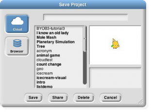

This is much like the Open dialog, except for the horizontal text box at the top, into which you type a name for the project. You can also share, unshare, and delete projects from here. If you are logged in, the dialog starts with Cloud selected; if not, Browser will be selected.

The Import… menu option is for bringing some external resource into the current project, rather than loading an entirely separate project. You can import costumes (any picture format that your browser supports), sounds (again, any format supported by your browser), and block libraries (XML format, previously exported from Snap!itself). Imported costumes and sounds will belong to the currently selected sprite; imported blocks are global (for all sprites). Using the Import option is equivalent to dragging the file from your desktop onto the Snap!window.

The Export project… option opens a new browser tab containing your complete project in XML notation (a plain text format). You can then use the browser’s Save feature to save the project as an XML file, which should be named your-project-name.xml so that Snap!will recognize it as a project when you later drag it onto a Snap!window. This is an alternative to saving the project to your cloud account, keeping it on your own computer.

The Export blocks… option is used to create a block library. It presents a list of all the global (for all sprites) blocks in your project, and lets you select which to export. It then opens a browser tab with those blocks in XML format, as with the Export project option. Block libraries can be imported with the Import option or by dragging the file onto the Snap!window.

The Import tools option imports a library of useful tool blocks that you should think of as Snap!primitive blocks even though they are actually written in Snap!. This manual assumes that the tools library has been imported, especially in the explanation of lists.

The Libraries… option presents a menu of useful, optional block libraries:

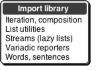

The libraries and their contents may change, but as of this writing the iteration library has these blocks:

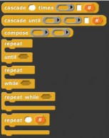

The cascade blocks take an initial value and call a function repeatedly on that value,

f(f(f(f…(x)))).

The compose block takes two functions and reports the function _f_(_g_(_x_)).

The first three repeat blocks are variants of the primitive repeat until block, giving all four combinations of whether the first test happens before or after the first repetition, and whether the condition must be true or false to continue repeating. The last repeat block is like the repeat primitive, but makes the number of repetitions so far available to the repeated script.

The list library has these blocks:

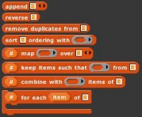

The append block takes any number of list inputs and reports a list of all the items of all the input lists. Reverse reports a list with the items of the input list in reverse order. Remove duplicates from reports a list in which no two items are equal. The sort block takes a list and a two-input comparison predicate, such as

### <, and reports a list with the items sorted according to that comparison. {#and-reports-a-list-with-the-items-sorted-according-to-that-comparison}

The other four blocks are versions of the list tools that provide a # variable containing the position in the input list of the currently considered item. This version of map also allows multiple list inputs, in which case the mapping function

must take as many inputs as there are lists; it will be called with all the first items, all the second items, and so on.

The stream library has these blocks:

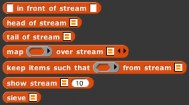

_Streams_ are a special kind of list whose items are not computed until they are needed. This makes certain computations more efficient, and also allows the creation of lists with infinitely many items, such as a list of all the positive integers. The first five blocks are stream versions of the list blocks in front of, item 1 of, all but first of, map, and keep. Show stream takes a stream and a number as inputs, and reports an ordinary list of the first _n_ items of the stream.

Finally, sieve is an example block that takes as input the stream of integers starting with 2 and reports the stream of all the prime numbers.

The variadic library has these blocks:

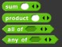

These are versions of the associative operators +. ×, and, and or that take any number of inputs instead of exactly two inputs. As with any variadic input, you can also drop a list of values onto the arrowheads instead of providing the inputs one at a time.

The word and sentence library has these blocks:

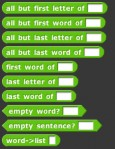

These blocks make it more convenient to think of a text string either as a _word_ made of letters or as a _sentence_ made of words, rather than of individual characters. Each word of a sentence is a string of characters not including a space. That is, the sentence-related blocks split the string up at space characters. Any number of consecutive spaces counts as a single separator. The names should be self-explanatory except for the last block, which takes a text string as input and reports a list of one-character-long strings.

**The Cloud Menu** The cloud icon see this menu:

shows a menu of options relating to your Snap! cloud account. If you are not logged in, you

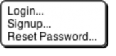

Choose Login… if you have a Snap!account and remember your password. Choose Signup… if you don’t have an account. Choose Reset Password… if you’ve forgotten your password or just want to change it. You will then get an email, at the address you gave when you created your account, with a new temporary password.

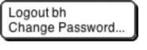

Use that password to log in, then you can choose your own password, as shown below. If you are already logged in, you’ll see this menu:

### Logout is obvious, but has the additional benefit of showing you who’s logged in. Change password… will ask for your old password (the temporary one if you’re resetting your password) and the new password you want, entered twice because it doesn’t echo. {#logout-is-obvious-but-has-the-additional-benefit-of-showing-you-who-s-logged-in-change-password-will-ask-for-your-old-password-the-temporary-one-if-you-re-resetting-your-password-and-the-new-password-you-want-entered-twice-because-it-doesn-t-echo}

The Settings Menu

The settings icon

shows a menu of Snap!options, either for the current project or for you permanently,

depending on the option:

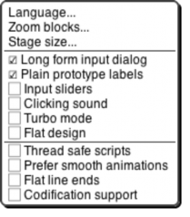

The Language… option lets you see the Snap! user interface (blocks and messages) in a language other than English. (Note: Translations have been provided by Snap! users. If your native language is missing, send us an email!)

The Zoom blocks... option lets you change the size of blocks, both in the palettes and in scripts. The standard size is 1.0 units. The main purpose of this option is to let you take very high-resolution pictures of scripts for use on posters. It can also be used to improve readability when projecting onto a screen while lecturing, but bear in mind that it doesn’t make the palette or script areas any wider, so your computer’s command-option-+ feature may be more practical. Note that a zoom of 2 is gigantic! Don’t even try 10.

The remaining options let you turn various features on and off. Long form input dialog, if checked, means that whenever a custom block input name is created or edited, you immediately see the version of the input name dialog that includes the type options, default value setting, etc., instead of the short form with just the name and the choice between input name and title text. The default (unchecked) setting is definitely best for beginners, but more experienced Snap!programmers may find it more convenient always to see the long form.

### Plain prototype labels eliminates the plus signs between words in the Block Editor prototype block. This makes it harder to add an input to a custom block; you have to hover the mouse where the plus sign would have been, until a single plus sign appears temporarily for you to click on. It’s intended for people making pictures of scripts in the block editor for use in documentation, such as this manual. You probably won’t need it otherwise. {#plain-prototype-labels-eliminates-the-plus-signs-between-words-in-the-block-editor-prototype-block-this-makes-it-harder-to-add-an-input-to-a-custom-block-you-have-to-hover-the-mouse-where-the-plus-sign-would-have-been-until-a-single-plus-sign-appears-temporarily-for-you-to-click-on-it-s-intended-for-people-making-pictures-of-scripts-in-the-block-editor-for-use-in-documentation-such-as-this-manual-you-probably-won-t-need-it-otherwise}

### Input sliders provides an alternate way to put values in numeric input slots; if you click in such a slot, a slider appears that you can control with the mouse: {#input-sliders-provides-an-alternate-way-to-put-values-in-numeric-input-slots-if-you-click-in-such-a-slot-a-slider-appears-that-you-can-control-with-the-mouse}

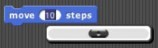

The range of the slider will be from 25 less than the input’s current value to 25 more than the current value. If you want to make a bigger change than that, you can slide the slider all the way to either end, then click on the input slot again, getting a new slider with a new center point. But you won’t want to use this technique to change the input value from 10 to 1000, and it doesn’t work at all for non-integer input ranges. This feature was implemented because software keyboard input on phones and tablets didn’t work at all in the beginning, and still doesn’t on Android devices, so sliders provide a workaround. It has since found another use in

providing “lively” response to input changes; if Input sliders is checked, reopening the settings menu will show an additional option called Execute on slider change. If this option is also checked, then changing a slider in the scripting area automatically runs the script in which that input appears. The project live-tree in the Examples collection shows how this can be used; it features a fractal tree custom block with several inputs, and you can see how each input affects the picture by moving a slider. This option is per-project, not per-user.

Clicking sound causes a really annoying sound effect whenever one block snaps next to another in a script. Certain very young children, and our colleague Dan Garcia, like this, but if you are such a child you should bear in mind that driving your parents or teachers crazy will result in you not being allowed to use Snap!.

Turbo mode makes most projects run much faster, at the cost of not keeping the stage display up to date. (Snap! ordinarily spends most of its time drawing sprites and updating variable watchers, rather than actually carrying out the instructions in your scripts.) So turbo mode isn’t a good idea for a project with glide blocks or one in which the user interacts with animated characters, but it’s great for drawing a complicated fractal, or computing the first million digits of D, so that you don’t need to see anything until the final result. While in turbo mode, the button that normally shows a green flag instead shows a green lightning bolt. (But when D clicked hat blocks still activate when the button is clicked.)

Flat design changes the “skin” of the Snap!window to a really hideous design with white and pale-grey background, rectangular rather than rounded buttons, and monochrome blocks (rather than the shaded, somewhat 3D-looking normal blocks). The monochrome blocks are the reason for the “flat” in the name of this option. The only thing to be said for this option is that it may blend in better with the rest of a web page when a Snap!project is run in a frame in a larger page.

Thread safe scripts changes the way Snap!responds when an event (clicking the green flag, say) starts a script, and then, while the script is still running, the same event happens again. Ordinarily, the running process stops where it is, ignoring the remaining commands in the script, and the entire script starts again from the top. This behavior is inherited from Scratch, and some converted Scratch projects depend on it; that’s why it’s the default. It’s also sometimes the right thing, especially in projects that play music in response to mouse clicks or keystrokes. If a note is still playing but you ask for another one, you want the new one to start right then, not later after the old process finishes. But if your script makes several changes to a database and is interrupted in the middle, the result may be that the database is inconsistent. When you select Thread safe scripts, the same event happening again in the middle of running a script is simply ignored. (This is arguably still not the right thing; the event should be remembered and the script run again as soon as it finishes. We’ll probably get around to adding that choice eventually.)

Prefer smooth animations slows down Snap!   ’sframe rate (time between updates to the display) to a fixed 1/30 second, like Scratch. (Ordinarily Snap! updates the display as often as possible.) One reason you might want this, explaining the option’s name, is to ensure that sprites move a constant distance from one redisplay to the next, so that motion seems smooth rather than jerky. Another reason is to ensure that your program runs at the same speed on different computers. A third reason, somewhat counterintuitive, is that a project with many scripts running at once (for example, one that clones sprites repeatedly) may run _faster_ if more time is available for scripts because less time is spent on the display of the screen.

### Flat line ends affects the drawing of thick lines (large pen width). Usually the ends are rounded, which looks best when turning corners. With this option selected, the ends are flat. It’s useful for drawing a brick wall. {#flat-line-ends-affects-the-drawing-of-thick-lines-large-pen-width-usually-the-ends-are-rounded-which-looks-best-when-turning-corners-with-this-option-selected-the-ends-are-flat-it-s-useful-for-drawing-a-brick-wall}

Codification support enables an experimental feature that can translate a Snap!project to a text-based (rather than block-based) programming language. The feature doesn’t know about any particular other language; instead, you can provide a translation for each primitive block using these special blocks:

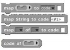

Using these primitive blocks, you can build a block library to translate into any programming language. Watch for such libraries to be added to our library collection (or contribute one). To see some examples, open the project “Codification” in the Examples project list. Edit the blocks map to Smalltalk, map to JavaScript, etc., to see examples of how to provide translations for blocks.

Stage Resizing Buttons

Still in the tool bar, but above the left edge of the stage, are two buttons that change the size of the stage. The first is the shrink/grow button. Normally it looks like this: Clicking the button displays the stage at half- normal size horizontally and vertically (so it takes up ¼ of its usual area). When the stage is half size the button looks like this: and clicking it returns the stage to normal size. The main reason you’d want a half size stage is during the development process, when you’re assembling scripts with wide input expressions and the normal scripting area isn’t wide enough to show the complete script. You’d typically then switch back to normal size to try out the project. The next presentation mode button normally looks like this: Clicking the button makes the stage double size in both dimensions and eliminates most of the other user interface elements (the palette, the scripting area, the sprite corral, and most of the tool bar). When you open a shared project using a link someone has sent you, the project starts in presentation mode. While in presentation mode, the button looks like this: Clicking it returns to normal (project development) mode.

Project Control Buttons

Above the right edge of the stage are three buttons that control the running of the project.

Technically, the green flag is no more a project control than anything else that can trigger a hat block: typing on the keyboard or clicking on a sprite. But it’s a convention that clicking the flag should start the action of the project from the beginning. It’s only a convention; some projects have no flag-controlled scripts at all, but respond to keyboard controls instead. Shift-clicking the button enters Turbo mode, and the button then looks like a lightning bolt: Shift-clicking again turns Turbo mode off.

### Scripts can simulate clicking the green flag by broadcasting the special message shout go (two underscores in each of the three positions shown). {#scripts-can-simulate-clicking-the-green-flag-by-broadcasting-the-special-message-shout-go-two-underscores-in-each-of-the-three-positions-shown}

The pause button suspends running all scripts. If clicked while scripts are running, the button changes shape to become a play button: Clicking it while in this form resumes the suspended scripts. There is also a pause block in the Control palette that can be inserted in a script to suspend all scripts; this provides the essence of a breakpoint debugging capability.

The stop button stops all scripts, like the stop all block. It does _not_ prevent a script from starting again in response to a click or keystroke; the user interface is always active.