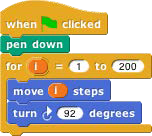
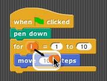
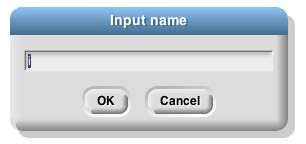
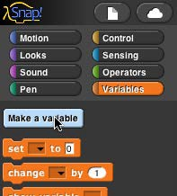
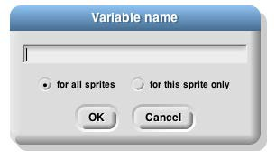
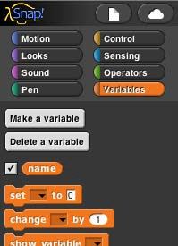
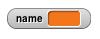
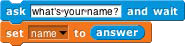
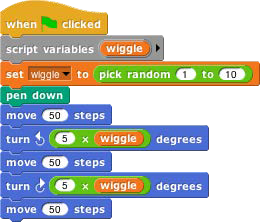
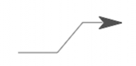

## Variables {#variables}

Try this script:1

The input to the move block is an orange oval. To get it there, drag the orange oval that’s part of the for block:

The orange oval is a _variable:_ a symbol that represents a value. (I took this screenshot before changing the second number input to the for block from the default 10 to 200, and before dragging in a turn block.) For runs its script input repeatedly, just like repeat, but before each repetition it sets the variable i to a number starting with its first numeric input, adding 1 for each repetition, until it reaches the second numeric input. In this case, there will be 200 repetitions, first with i=1, then with i=2, then 3, and so on until i=200 for the final repetition. The result is that each move draws a longer and longer line segment, and that’s why the picture you see is a kind of spiral. (If you try again with a turn of 90 degrees instead of 92, you’ll see why this picture is called a “squiral.”)

The variable i is created by the for block, and it can only be used in the script inside the block’s C-slot. (By the way, if you don’t like the name i, you can change it by clicking on the orange oval without dragging it, which will pop up a dialog window in which you can enter a different name:

“I” isn’t a very descriptive name; you might prefer “length” to indicate its purpose in the script. “I” is traditional because mathematicians tend to use letters between i and n to represent integer values, but in programming languages we don’t have to restrict ourselves to single-letter variable names.)

1 The for block is also in the tools library; choose “Import tools” from the file menu if you don’t have it in the Control palette.

Global Variables

You can create variables “by hand” that aren’t limited to being used within a single block. At the top of the Variables palette, click the “Make a variable” button:

This will bring up a dialog window in which you can give your variable a name:

The dialog also gives you a choice to make the variable available to all sprites (which is almost always what you want) or to make it visible only in the current sprite. You’d do that if you’re going to give several sprites individual variables _with the same name,_ so that you can share a script between sprites (by dragging it from the current sprite’s scripting area to the picture of another sprite in the sprite corral), and the different sprites will do slightly different things when running that script because each has a different value for that variable name.

If you give your variable the name “name” then the Variables palette will look like this:

There’s now a “Delete a variable” button, and there’s an orange oval with the variable name in it, just like the orange oval in the for block. You can drag the variable into any script in the scripting area. Next to the oval is a checkbox, initially checked. When it’s checked, you’ll also see a _variable watcher_ on the stage:

When you give the variable a value, the orange box in its watcher will display the value. How _do_ you give it a value? You use the set block:

Note that you _don’t_ drag the variable’s oval into the set block! You click on the downarrow in the first input slot, and you get a menu of all the available variable names.

Script Variables

In that example, our project is going to carry on an interaction with the user, and we want to remember her name throughout the project. That’s a good example of a situation in which a _global_ variable (the kind you make with the “Make a variable” button) is appropriate. Another common example is a variable called “score” in a game project. But sometimes you only need a variable temporarily, during the running of a particular script. In that case you can use the script variables block to make the variable:

 

As in the for block, you can click on an orange oval in the script variables block without dragging to change its name. You can also make more than one temporary variable by clicking on the right arrow at the end of the block to add another variable oval:

