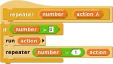
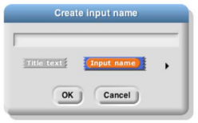
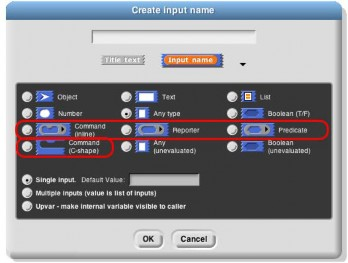
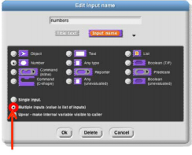
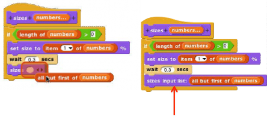
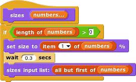
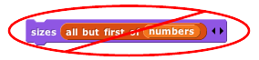

## Writing Higher Order Procedures {#writing-higher-order-procedures}

A _higher order procedure_ is one that takes another procedure as an input, or that reports a procedure. In this document, the word “procedure” encompasses scripts, individual blocks, and nested reporters. (Unless specified otherwise, “reporter” includes predicates. When the word is capitalized inside a sentence, it means specifically oval-shaped blocks. So, “nested reporters” includes predicates, but “a Reporter-type input” doesn’t.)

Although an Any-type input slot (what you get if you use the small input-name dialog box) will accept a procedure input, it doesn’t automatically ring the input as described above. So the declaration of Procedure- type inputs makes the use of your custom higher order block much more convenient.

Why would you want a block to take a procedure as input? This is actually not an obscure thing to do; the primitive conditional and looping blocks (the C-shaped ones in the Control palette) take a script as input. Users just don’t usually think about it in those terms! We could write the repeat block as a custom block this way, if Snap! didn’t already have one:

The lambda (λ) next to action in the prototype indicates that this is a C-shaped block, and that the script enclosed by the C when the block is used is the input named action in the body of the script. The only way to make sense of the variable action is to understand that its value is a script.

To declare an input to be Procedure-type, open the input name dialog as usual, and click on the arrowhead:

Then, in the long dialog, choose the appropriate Procedure type. The third row of input types has a ring in the shape of each block type (jigsaw for Commands, oval for Reporters, and hexagonal for Predicates). In practice, though, in the case of Commands it’s more common to choose the C-shaped slot on the fourth row, because this “container” for command scripts is familiar to Scratch users. Technically the C-shaped slot is an _unevaluated_ procedure type, something discussed in Section E below. The two Command-related input types (inline and C- shaped) are connected by the fact that if a variable, an item (#) of [list] block, or a custom Reporter block is dropped onto a C-shaped slot, it turns into an inline slot, as in the repeater block’s recursive call above. (Other built-in Reporters can’t report scripts, so they aren’t accepted in a C-shaped slot.)

Why would you ever choose an inline Command slot rather than a C shape? Other than the run block discussed below, the only case I can think of is something like the C/C++/Java for loop, which actually has three command script inputs (and one predicate input), only one of which is the “featured” loop body:

Okay, now that we have procedures as inputs to our blocks, how do we use them? We use the blocks run (for commands) and call (for reporters). The run block’s script input is an inline ring, not C-shaped, because we anticipate that it will be rare to use a specific, literal script as the input. Instead, the input will generally be a variable whose _value_ is a script.

The run and call blocks have arrowheads at the end that can be used to open slots for inputs to the called procedures. How does Snap! know where to use those inputs? If the called procedure (block or script) has empty input slots, Snap! “does the right thing.” This has several possible meanings:

1.  If the number of empty slots is exactly equal to the number of inputs provided, then Snap! fills the empty slots from left to right:

    

2.  If exactly one input is provided, Snap! will fill any number of empty slots with it:

3.  Otherwise, Snap! won’t fill any slots, because the user’s intention is unclear.

If the user wants to override these rules, the solution is to use a ring with explicit input names that can be put into the given block or script to indicate how inputs are to be used. This will be discussed more fully below.

Recursive Calls to Multiple-Input Blocks

A relatively rare situation not yet considered here is the case of a recursive block that has a variable number of inputs. Let’s say the user of your project calls your block with five inputs one time, and 87 inputs another time. How do you write the recursive call to your block when you don’t know how many inputs to give it? The answer is that you collect the inputs in a list (recall that, when you declare an input name to represent a variable number of inputs, your block sees those inputs as a list of values in the first place), and then, in the recursive call, you drop that input list _onto the arrowheads_ that indicate a variable-input slot, rather than onto the input slot:

 

Note that the halo you see while dragging onto the arrowheads is red instead of white, and covers the input slot as well as the arrowheads. And when you drop the expression onto the arrowheads, the words “input list:” are added to the block text and the arrowheads disappear (in this invocation only) to remind you that the list represents all of the multiple inputs, not just a single input. The items in the list are taken _individually_ as inputs to the script. Since numbers is a list of numbers, each individual item is a number, just what sizes wants. This block will take any number of numbers as inputs, and will make the sprite grow and shrink accordingly:

 

The user of this block calls it with any number of _individual numbers_ as inputs. But inside the definition of the block, all of those numbers form _a list_ that has a single input name, numbers. This recursive definition first checks to make sure there are any inputs at all. If so, it processes the first input (item 1 of the list), then it wants to make a recursive call with all but the first number. But sizes doesn’t take a list as input; it takes numbers as inputs! So this would be wrong: